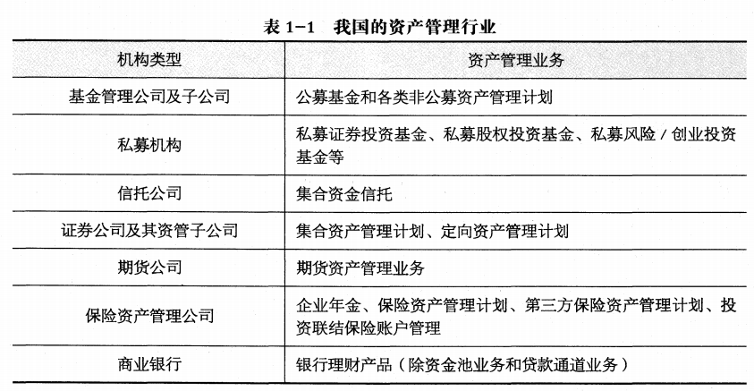

# 金融市场、资产管理与投资基金

## 1.1 居民理财与金融市场

> 理解金融与居民理财的关系、金融市场的分类和构成要素

### 金融与居民理财

金融：货币资金的融通

居民：包括个人与企业，是社会最古老、最基本的经济主体 

理财：对财务进行管理，实现财产的增值、保值

居民理财方式：

1. 货币储蓄(居民主要理财方式)，特征是保值性
2. 投资(股票、债券、基金等)，未来收益具有不确定性

### 金融市场

金融市场与金融服务机构是现代金融体系的两大运作载体

**分类：**

1. 按交易工具的期限划分：
    - 货币市场——短期金融市场，融通一年以内短期资金的场所
    - 资本市场——长期金融市场，以期限在一年以上的有价证券为交易工具进行长期资金交易的市场
        - 银行中长期存贷款市场
        - 有价证券市场，包括中长期债券市场和股票市场 (狭义)
2. 按交易标的物(当事人双方权利义务指向的对象)划分：
    - 票据市场(货币市场的重要组成部分)，按交易方式分为票据承兑市场和票据贴现市场
    - 证券市场，股票、债券、基金等有价证券发行和转让流通的市场
    - 衍生工具市场(套期保值、防范风险的作用)，各种衍生金融工具交易的市场，包括远期合约、期货合约、期权合约、互换合约等
    - 外汇市场
    - 黄金市场
3. 按交割期限划分：
    - 现货市场，交易协议达成后两个交易日内交割
    - 期货市场，交易协议达成后未来某一时间进行交割
4. 按交易性质划分：
    - 发行市场，也称初级市场
    - 流通市场，也称二级市场

**构成要素：**

1. 市场参与者，包括政府、中央银行、金融机构(资金供给者、需求者、中间人；支配性作用)、个人与企业居民(主要资金供给者、供求均衡重要力量)
2. 金融工具(最初被称为信用工具)，金融市场进行交易的载体
3. 金融交易的组织方式
    - 场内交易，有固定场所、有制度、集中进行交易的方式，比如交易所交易方式
    - 场外交易，在各金融机构柜台上买卖双方面议、分散进行交易的方式，比如柜台交易方式
    - 电信网络交易，无固定场所，买卖双方不面议，通过网络技术进行交易

## 1.2 金融资产与资产管理行业

> 理解金融资产的概念、资产管理的特征与资产管理行业的功能

金融资产：在金融市场上，资金的供给者通过投资金融工具获得各种类型的金融资产，是代表未来收益或资产合法要求权的凭证，标识了明确的价值，表明了交易双方的所有权与债权关系

金融资产一般分为以下两类：
1. 债权类金融资产，以票据与债券等契约型投资工具为主
2. 股权类金融资产，以各类股票为主

资产管理一般是指金融机构受投资者委托，为实现投资者的特定目标和利益，进行
证券和其他金融产品的投资并提供金融资产管理服务，并收取费用的行为

资产管理的特征：

1. 从参与方来看，资产管理包括委托方(投资者)与受托方(资产管理人)
2. 从受托资金来看，主要为货币等金融资产，一般不包括固定资产等实物资产
3. 从管理方式来看，资产管理主要通过投资于银行存款、证券、债券、期货、基金、保险或实体企业股权等资产实现增值

资产管理机构(美国: 银行、保险公司、专业资产管理公司；中国: 基金管理公司、信托公司、银行、证券、保险等公司)构成了资产管理行业

资产管理行业的功能和作用：

1. 资产管理行业能够为市场经济体系有效配置资源，使有限的资源配置到最有效率的产品和服务部门，提高整个社会经济的效率和生产服务水平
2. 通过资产管理行业专业的管理活动，能够帮助投资人搜集、处理各种和投资有关的宏观、微观信息，提供各类投资机会，帮助投资者进行投资决策，并提供决策的最佳执行服务，使投资融资更加便利
3. 资产管理行业创造出十分广泛的投资产品和服务，满足投资者的各种投资需求，使资金的需求方和提供方能够便利地连接起来
4. 资产管理行业还能对金融资产进行合理定价，给金融市场提供流动性，降低交易成本，使金融市场更加健康有效，最终有利于一国经济的发展

## 1.3 我国资产管理行业的状况

> 理解各类资产管理业务

资产管理业务(前三是传统的)：

1. 公募基金
2. 私募基金
3. 信托计划
4. 券商资管
6. 期货资管
5. 保险资管
7. 银行理财

## 1.4 投资基金简介

> 掌握投资基金的定义和主要类别

投资基金的定义：
1. 是资产管理的主要方式之一
2. 是一种组合投资、专业管理、利益共享、风险共担的集合投资方式
3. 是一种间接投资工具

投资基金所投资的资产：
1. 金融资产(股票、债券、外汇、股权、期货、期权等)
2. 房地产、大宗能源、林权、艺术品等其他资产

投资基金运作的主要当事人：
1. 基金投资者
2. 基金管理人
3. 托管人

投资基金的主要分类：

1. 按基金募集方式：
    - 公募基金，向不特定投资者公开发行受益凭证进行资金募集的基金，部门严管
    - 私募基金，私下或直接向特定投资者募集的资金，对投资者的投资能力有一定要求，监管要求较低，较为灵活
2. 按法律法律形式：
    - 契约型
    - 公司型
    - 有限合伙型
3. 按运作方式：
    - 开放型
    - 封闭型
4. 按投资对象的不同(主要划分方式)：
    - 证券投资基金(主要)，包括股票、债券、货币、金融衍生工具等在证券交易所或银行间市场上公开交易的证券
    - 私募股权(private equity PE)基金，通过私募形式对非上市企业进行的权益行投资
    - 风险投资(venture capital VC)基金，主要通过投向那些不具备上市资格的初创期或者小型的新型企业，尤其是高新技术企业
    - 对冲投资基金，利用各种金融衍生产品的杠杆效应，承担高风险、追求高收益的投资模式
    - 另类投资基金，投资于传统的股票和债券外的金融和实物资产