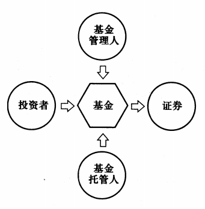
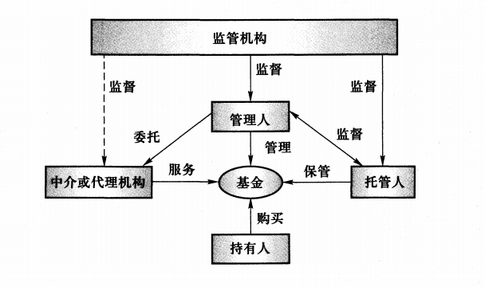
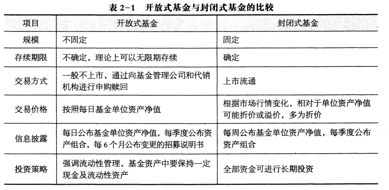

# 证券投资基金概述

## 2.1 证券投资基金的概念和特点

> 了解证券投资基金的概念和在其他国家和地区的名称；  
> 掌握证券投资基金的基本特点；  
> 理解证券投资基金与其他金融工具的比较；

证券投资基金的概念：

证券投资基金在其他国家和地区的名称：
1. 美国，共同基金(mutual fund)
2. 英国或中国香港，单位信托基金(unit trust)
3. 日本或中国台湾，证券投资信托基金(securities investment trust)
4. 欧洲一些国家，集合投资基金或集合投资计划(collective investment scheme)

证券投资基金的基本特点：
1. 集合理财、专业管理
2. 组合投资、分散风险
3. 利益共享、风险共担
4. 严格监管、信息透明
5. 独立托管、保障安全

证券投资基金与其他金融工具的比较：
1. 与股票、债券的差异
    1. 反映的经济关系不同
        - 股票，所有权关系，所有权凭证
        - 债券，债权债务关系，债权凭证
        - 基金，信托关系，收益凭证
    2. 所筹资金投向不同
        - 股票和债券是直接投资工具，资金投向实业领域
        - 基金是简介投资工具，资金投向有价证券等金融工具或产品
    3. 投资收益与风险大小不同
        - 股票，高风险高收益
        - 基金，中风险中收益
        - 债券，低风险低收益
2. 与银行储蓄存款的差异(基金通过银行代销，但不是银行发行的)
    1. 性质不同
        - 基金，收益凭证，基金财产独立于基金管理人，管理人不承担投资损失的风险
        - 银行储蓄存款，信用凭证，表现为银行的负债，银行具有保本付息责任
    2. 收益与风险特性不同
        - 基金，存在一定投资风险
        - 银行储蓄存款，存款利率相对固定，投资者损失本金的风险很小
    3. 信息披露程度不同
        - 基金，必须定期向投资者公布基金投资运作情况
        - 银行，不需要向存款人披露资金的运用情况

## 2.2 证券投资基金的运作与参与主体

> 了解基金行业的运作环节包括：募集、投资管理、托管、登记、估值和会计核算、信息披露等；  
> 理解基金行业的主要参与者及其功能和运作关系；

基金的运作：
1. 基金的募集
2. 基金的投资管理
3. 基金份额的登记交易
4. 基金估值
5. 会计核算
6. 基金信息披露
7. 其他基金运作活动在内的所有相关环节

基金管理人角度的基金运作：
1. 基金的市场营销
    - 基金份额的募集
    - 客户服务
2. 基金的投资管理(体现了管理人的服务价值)
3. 基金的后台管理
    - 基金份额的注册登记
    - 基金资产的估值
    - 会计核算
    - 信息披露等

基金参与主体：
1. 基金当事人
    - 基金份额持有人
    - 基金管理人(基金运作中具有核心作用)，由基金管理公司担任
    - 基金托管人，由取得基金托管资格的商业银行或其他金融机构担任
2. 基金市场服务机构
    - 基金管理人、基金托管人既是基金的当事人，又是基金的主要服务机构
    - 基金销售机构，基金宣传推介、份额发售、份额的申购和赎回
    - 销售支付机构
    - 份额登记机构，是指基金份额的登记过户、存管和结算等业务活动
    - 估值核算机构，是指基金会计核算、估值及相关信息披露等业务活动
    - 投资顾问机构
    - 评价机构，是指对基金投资收益和风险或者基金管理人管理能力进行的评级、评奖、单一指标排名或者中国证监会认定的其他评价活动
    - 信息技术系统服务机构
    - 律师事务所
    - 会计师事务所等
3. 基金监管机构和自律组织
    - 基金监管机构(基金运作中起重要作用)：对基金管理人、基金托管人以及其他从事基金活动的服务机构进行监督
    - 自律组织，是由基金管理人、基金托管人及基金市场服务机构共同成立的同业协会
        - 证券交易所是基金的自律管理机构之一，实行自律性管理的法人
        - 我国是2012年6月6日成立的中国证券投资基金业协会

基金运作关系：

## 2.3 证券投资基金的法律形式和运作方式

> 理解公司型基金和契约型基金的区别，开放式基金和封闭式基金的区别；  
> 掌握信托法基本原理、信托的特征和功能；  
> 掌握信托主体、信托财产的基本内容；  
> 掌握受托人信义义务、受托责任的基本内容；

按照法律形式的不同分为：
1. 契约型基金(目前，我国均为契约型基金)
2. 公司型基金(美国的投资公司为代表)

契约型基金：是依据基金合同设立的一类基金；在我国，契约型基金依据基金管理人、基金托管人之间所签署的基金合同设立

公司型基金：依据基金公司章程设立，在法律上是具有独立法人地位的股份投资公司；基金投资者是基金公司的股东，享有股东权，按所持有的股份承担有限责任 ，分享投资收益

公司型基金和契约型基金的区别：
1. 法律主体资格不同，契约型基金不具有法人资格，公司型基金具有法人资格
2. 投资者的地位不同，与公司型基金股东大会相比，契约型基金持有人大会赋予基金持有者的权利相对较小
3. 基金营运依据不同(无优劣之分)，契约型基金(在设立上更为简单易行)依据基金合同营运基金，公司型基金(法律关系明确，监督约束机制较为完善)依据投资公司章程营运基金

按照运行方式的不同分为：
1. 开放式基金
2. 封闭式基金

封闭式基金：是指基金份额在基金合同期限内固定不变，基金份额可以在依法设立的证券交易所交易，但基金份额持有人不得申请赎回的一种基金运作方式

开放式基金：是指基金份额不固定，基金份额可以在基金合同约定的时间和场所进行申购或者赎回的一种基金运作方式(专指传统的开放式基金，不包括交易型开放式指数基金ETF和上市开放式基金LOF等新型开放式基金

开放式基金与封闭式基金的区别：
1. 期限不同
    - 封闭式基金一般有固定的存续期(合同中必须规定基金封闭期，期满后可以延期或转开放式)
    - 开放式基金一般是无特定存续期
2. 份额限制不同
    - 封闭式基金份额是固定的
    - 开放式基金份额会随着投资者随时的申购和赎回而增加或减少
3. 交易场所不同
    - 封闭式基金的交易在投资者之间完成(场内交易)，投资者买卖封闭式基金份额，只能委托证券公司在证券交易所按市价买卖
    - 开放式基金的交易在投资者与基金管理人之间完成
4. 价格形成方式不同
    - 封闭式基金的交易价格主要受二级市场供求关系的影响
    - 开放式基金的买卖价格以基金份额净值为基础，不受市场供求关系的影响
5. 激励约束机制与投资策略不同
    - 开放式基金向基金管理人提供了更好的激励约束机制
    - 开放式基金必须保留一定的现金资产，并高度重视基金资产的流动性，这在一定程度上会给基金的长期经营业绩带来不利影响
    - 封闭式基金份额固定，没有赎回压力，基金投资管理人员完全可以根据预先设定的投资计划进行长期投资和全额投资，一定程度上有利于基金长期业绩的提高

## 2.4 证券投资基金的起源与发展

> 了解证券投资基金的起源、发展历程、 发展趋势与特点

**证券投资基金的起源与早期发展:**

世界上第一只公认的证券投资基金——“海外及殖民地政府信托”诞生在1868年的英国

投资基金真正的大发展却是在美国

1924年(从起源已历经56年)由200多名哈佛大学教授出资5万美元在波士顿成立的“马萨诸塞投资信托基金”被公认为美国开放式公司型共同基金的鼻袓

1929年(历经5年即股市崩盘)美国股市崩盘，随之而来经济大萧条，使刚刚起步的美国基金业遭受了重大打击

此后，美国国会通过了多部法律来保护投资者，建立了对证券市场（包括共同基金业）和金融市场的监管体制

1933年(历经4年)美国《证券法》要求基金募集时必须发布招募说明书，对基金进行描述

1934年美国《证券交易法》要求共同基金的销售商要受证券交易委员会(SEC)的监管，并且置于全美证券商协会(NASD)的管理权限之下，NASD对广告和销售设有具体规则

(又历经6年)1940年 《投资公司法》和 1940年《投资顾问法》是美国关于共同基金的两部最重要的法律

第二次世界大战以后，各发达国家政府更加明确认识到投资基金业的重要性，以及基金对稳定金融市场所起的作用，从而大大提高了对投资基金业的重视程度

**证券投资基金在美国及全球的普及型发展:**

美国开放式基金发展顺序大致是，股票型基金->平衡型基金->债券型基金->货币型基金

在1970年以前，美国大多数共同基金是股票基金，只有一些平衡型基金在其组合中包括一部分债券

1971年，美国第一只货币市场基金建立，货币市场基金提供比银行储蓄账户更高的市场利率，并且具有签发支票的类货币支付功能

不同类型养老计划(IRA与401K)的出现和繁荣，极大地推动了对共同基金的需求

从区域看，全球投资基金的资产主要集中在北美和欧洲

在近30年中，美国共同基金业的迅速发展壮大与退休养老金的快速增长紧密相关

**全球基金业发展的趋势与特点:**
1. 美国占据主导地位，其他国家和地区发展迅猛(目前，美国的证券投资基金资产净值总值占世界半数以上)
2. 开放式基金成为证券投资基金的主流产品(开放式基金更加市场化的运作机制和制度安排是非常重要的因素之一)
3. 基金市场竞争加剧，行业集中趋势突出(资产规模位居前列的少数最大的基金公司所占的市场份额不断扩大)
4. 基金资产的资金来源发生了重大变化(个人投资者一直是传统上证券投资基金的主要投资者，但目前已有越来越多的机构投资者，特别是退休养老金成为基金的重要资金来源)

## 2.5 我国证券投资基金业的发展历程

> 了解我国证券投资基金发展的五个阶段以及每个阶段的特点和标志产品

**萌芽和早期发展时期(1985—1997年):**

在20世纪80年代末，一批由中资或外资金融机构在境外设立的“中国概念基金”相继推出，这些“中国概念基金”一般均是由国外及我国香港等地基金管理机构单独或者与境内机构联合设立，投资于在香港上市的大陆企业或者中国大陆企业的股票

1992年6月，深圳市率先公布了《深圳市投资信托基金管理暂行规定》，同年11月经深圳市人民银行批准成立了深圳市投资基金管理公司，发起设立了当时国内规模最大的封闭式基金—天骥基金

1992年11月，经中国人民银行总行批准的国内第一家投资基金一淄博乡镇企业投资基金(简称“淄博基金”)正式设立，并于1993年8月在上海证券交易所挂牌上市，成为我国首只在证券交易所上市交易的投资基金，该基金为公司型封闭式基金，募集规模1亿元人民币

相对于1997年《证券投资基金管理暂行办法》实施以后发展起来的证券投资基金，习惯上将1997年以前设立的基金称为 “老基金“

这一时期存在主要三个问题：
1. 由于缺乏基本的法律规范，基金普遍存在法律关系不清、无法可依、监管不力
2. “老基金”资产大量投向了房地产、企业法人股权等，因此实际上可算是一种产业投资基金，而非严格意义上的证券投资基金
3. “老基金”深受90年代中后期我国房地产市场降温、实业投资无法变现以及贷款资产无法回收的困扰，资产质量普遍不高

**试点发展阶段(1998—2002年):**

1997年11月当时的国务院证券委员会颁布了《证券投资基金管理暂行办法》，为我国证券投资基金的规范发展奠定了法律基础

1998年3月27日，经中国证监会批准，新成立的南方基金管理公司和国泰基金管理公司分别发起设立了两只封闭式基金一 “基金开元”和 “基金金泰” 由此拉开了中国证券投资基金试点的序幕

1998年4月华夏基金公司发起设立了兴华基金，华安基金管理公司发起设立了安信基金

在封闭式基金成功试点的基础上，2000年10月8日，中国证监会发布并实施了《开放式证券投资基金试点办法》，由此揭开了我国开放式基金发展的序幕

2001年9月，我国第一只开放式基金—华安创新诞生

2002年12月，首家批准筹建的中外合资基金公司国联安基金管理有限公司成立，基金业成为履行我国证券服务业入世承诺的先锋

到2003年年底，我国开放式基金在数量上已超过封闭式基金成为证券投资基金的主要形式，资产净值不相上下。之后，开放式基金的数目和资产规模均远远超过封闭式基金

**快速发展阶段(2003—2008年):**

2003年10月28日，十届全国人大常委会第五次会议审议通过《中华人民共和国证券投资基金法》并于2004年6月1日施行，基金业的法律规范得到重大完善

《证券投资基金法》的出台为我国基金业的发展奠定了坚实的法律基础

2004年底首只交易型开放式指数基金-华夏上证50ETF

中国证监会在《证券投资基金法》的框架下出台了多项法规，规范基金行业，保护投资者利益。  
先后出台了《基金管理公司管理办法》《基金运作管理办法》《基金销售管理办法》《基金信息披露管理办法》等六项行政规章及若干配套监管文件，形成了以“一法六规”为核心的比较完善的监督管理法规体系

2007年7月，新的《企业会计准则》在基金业得到全面实施，为基金行业更为透明准确的信息披露提供了保证

**行业平稳发展及创新探索阶段(2008—2014年):**

允许基金管理公司开展专户管理等私募业务、设立子公司开展专项资产管理和销售业务、设立香港子公司从事RQFII等国际化业务

设立 “不能搞利用非公开信息获利、不能进行非公平交易、不能搞各种形式的利益输送”三条底线

2012年6月6日，中国证券投资基金业协会正式成立。伴随法律法规的修订完善，我国基金业的制度基础得以夯实，基金业的发展环境进一步得到优化，这拓展了基金业改革创新的空间

2012年12月28日，全国人大常委会审议通过了修订后的《证券投资基金法》并于2013年6月1日正式实施

修改后的《证券投资基金法》放宽了基金管理公司股东的资格条件

修订后的《证券投资基金法》的实施为基金服务机构大发展提供了空间，加速了行业外包市场的发展

修订后的《证券投资基金法》以及配套政策的颁布实施，搭建了大资产管理行业基本制度框架

**防范风险和规范发展阶段(2015年至今)**

## 2.6 证券投资基金业在金融体系中的地位与作用

> 理解基金对中小投资者的作用、对金融结构和经济的作用、对证券市场的作用；  
> 了解基金对完善金融体系和社会保障体系的作用、对推动社会责任投资的作用；

地位与作用:
1. 为中小投资者拓宽投资渠道
2. 优化金融结构，促进经济增长
3. 有利于证券市场的稳定和健康发展
4. 完善金融体系和社会保障体系
5. 推动责任投资，实现可持续发展(新增)