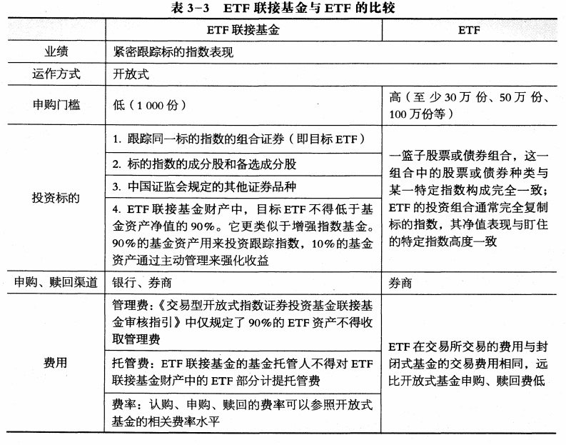

# 证券投资基金的类型

## 3.1 证券投资基金分类概述

> 掌握基金的不同分类标准和基本分类

**证券投资基金分类的意义：**
1. 对投资者而言，有助于其做出正确的投资选择与比较
2. 对基金管理公司而言，基金业绩的比较应该在同一类别中进行才公平合理
3. 对基金评价机构而言，基金的分类则是进行基金评级的基础
4. 对基金监管部门而言，明确基金的类别特征将有利于针对不同基金的特点实施更有效的分类监管

为统一基金分类标准，一些国家常常由监管部门或行业协会出面制定基金分类的统一标准

不过监管部门或行业协会的分类标准往往不够精细，无法满足投资者的实际投资需要

尽管存在不同的分类标准，投资者仍会借助一些基金评级公司的基金分类进行实际的投资操作

根据中国证监会颁布的、于2014年8月8日正式生效的《公开募集证券投资基金运作管理办法》，将公募证券投资基金划分为:
1. 股票基金
2. 债券基金
3. 货币市场基金
4. 混合基金
4. 基金中的基金等类别

**基金的分类标准:**
1. 按法律形式
    - 契约型
    - 公司型等
2. 按运作方式
    - 封闭式
    - 开放式
3. 按投资对象
    - 股票基金，基金资产80%以上投资于股票的为股票基金
    - 债券基金，基金资产80%以上投资于债券的为债券基金
    - 货币市场基金，仅投资于货币市场工具的为货币市场基金
    - 混合基金，股票投资和债券投资的比例不符合股票基金、债券基金规定的为混合基金
    - 基金中的基金(FOF)，80%以上的基金资产投资于其他基金份额的为基金中的基金
4. 按投资目标
    - 增长(成长)型，指以追求资本增值为基本目标的基金，主要以具有良好增长潜力的股票为投资对象
    - 收入型，指以追求稳定的经常性收入为基本目标的基金，主要以大盘蓝筹股、公司债、政府债券等稳定收益证券为投资对象
    - 平衡型，既注重资本增值又注重当期收入的基金
5. 按投资理念
    - 主动基金，是一类力图取得超越基准组合表现的基金
    - 被动(指数)基金，一般选取特定的指数作为跟踪的对象，并不主动寻求取得超越市场的表现
6. 按募集方式
    - 公募基金
    - 私募基金
7. 按资本来源和用途的不同
    - 在岸基金，指在本国募集资金并投资于本国证券市场的证券投资基金
    - 离岸基金，指一国的证券投资基金组织在他国发售证券投资基金份额，并将募集的资金投资于本国或第三国证券市场的证券投资基金，比如QFII
    - 国际基金，指资本来源于国内，并投资于国外市场的投资基金，比如QDII
    - 区域基金，指投资于某个特定地区的投资基金
8. 特殊类型基金
    - 系列(伞型)基金，是指多个基金共用一个基金合同，子基金独立运作，子基金之间可以进行相互转换的一种基金结构形式(基金管理公司角度看，具有简化管理、降低成本、强大扩张功能优势)
    - FOF是指以其他证券投资基金为投资对象的基金
    - 保本(避险策略)基金，指通过一定的保本投资策略进行运作，同时引入保本保障机制，以保证基金份额持有人在保本周期到期时，可以获得投资本金保证的基金
    - 上市交易型开放式指数(交易所交易)基金(ETF exchange traded funds)，是一种在交易所上市交易的、基金份额可变的一种开放式基金，诞生于加拿大，发展于美国
    - 上市开放式基金(LOF listed open-ended funds)，是一种既可以在场外市场进行基金份额申购、赎回，又可以在场内市场进行基金份额交易和基金份额申购或赎回的开放式基金(我国创新)，结合了银行等代销机构和交易所交易网络两者的销售优势
    - QDII基金，指在一国境内设立，经该国有关部门批准从事境外证券市场的股票、债券等有价证券投资的基金，为国内投资者参与国际市场投资提供了便利
    - 分级基金，指通过事先约定基金的风险收益分配，将基础份额分为预期风险收益不同的子份额，并可将其中部分或全部份额上市交易的结构化证券投资基金

## 3.2 基金的基本类别

> 掌握基金的基本类型及其特点

### 股票基金

股票基金在投资组合中的作用：
    - 股票基金以追求长期的资本增值为目标，比较适合长期投资
    - 与房地产一样，股票基金也是应对通货膨胀最有效的手段

股票基金与股票的区别：
    - 股票价格在每一交易日内始终处于变动之中；股票基金净值的计算每天只进行1次 ，因此每一交易日股票基金只有1个价格
    - 股票价格会由于投资者买卖股票数量的大小和强弱的对比而受到影响，股票基金份额净值不会由于买卖数量或申购、赎回数量的多少而受到影响
    - 人们在投资股票时， 一般会根据上市公司的基本面，如财务状况、市场竞争力、盈利预期等方面的信息对股票价格高低的合理性做出判断；对基金份额净值高低进行合理与否的判断是没有意义的
    - 单一股票的投资风险较为集中，投资风险较大；股票基金由于分散投资，投资风险低于单一股票的投资风险

股票可以根据所在市场、规模、性质以及所属行业等归结为几种主要类型

股票基金的类型：
1. 按投资市场分类
    - 国内股票基金，以本国股票市场为投资场所，投资风险主要受国内市场的影响
    - 国外股票基金，以非本国的股票市场为投资场所，由于币制不同，存在一定的汇率风险
        - 单一国家型股票基金
        - 区域型股票基金
        - 国际股票基金
    - 全球股票基金，以包括国内股票市场在内的全球股票市场为投资对象，进行全球化分散投资，可以有效克服单一国家或区域投资风险，但由于投资跨度大，费用相对较高
2. 按股票规模分类(市值绝对值划分、相对规模划分)
    - 小盘股票基金，市值小于5亿元人民币公司，累计市值占总市值排名20%以下
    - 中盘股票基金，5<市值<20亿人民币公司，20%<累计市值排名<50%
    - 大盘股票基金，市值大于20亿元人民币公司，累计市值占总市值50%以上
3. 按股票性质分类
    - 价值型股(是指收益稳定、价值被低估、安全性较高的股票，其市盈率、市净率通常较低)
        - 低市盈率股
        - 蓝筹股，规模大、发展成熟、高质量公司的股票
        - 收益型股
        - 防御型股，利润不随经济衰退而下降，可以有效抵御经济衰退影响
        - 逆势型股等，指价值被低估或非市场热点的一类股票，往往是典型的周期性衰退公司的股票
    - 成长型股(是指收益增长速度快、未来发展潜力大的股票，其市盈率、市净率通常较高)
        - 持续成长型股
        - 趋势增长型股
        - 周期型股
    - 平衡型股
4. 按投资风格分类，股票规模与股票性质求笛卡尔积
5. 按行业分类

### 债券基金

债券基金主要以债券为投资对象，因此对追求稳定收入的投资者具有较强的吸引力

债券基金与债券的区别：
1. 债券基金的收益不如债券的利息固定
2. 债券基金没有确定的到期日
3. 债券基金的收益率更难预测
4. 债券基金与债券的投资风险不同

债券基金的类型：
1. 根据债券发行者
    - 政府债券
    - 企业债券
    - 金融债券
2. 根据债券到期日
    - 短期债券
    - 长期债券
3. 根据债券信用等级
    - 低等级债券
    - 高等级债券
4. 我国市场债券基金的自身特点
    - 标准债务型基金(纯债基金)
        - 短债基金
        - 信用债基金
    - 普通债务型基金(占我国市场主要部分)，80%资产用于投资债券，也投资于股票市场
         - 一级债基，可参与一级市场新股申购、增发等但不参与二级市场买卖
         - 二级债基，既可参与一级市场又可在二级市场买卖股票
    - 其他策略型的债券基金，如可转债基金

### 货币市场基金

货币市场基金在投资组合中的作用：
1. 与其他类型基金相比，货币市场基金具有风险低、流动性好的特点
2. 货币市场基金是厌恶风险、对资产流动性和安全性要求较高的投资者进行短期投资的理想工具，或是暂时存放现金的理想场所
3. 货币市场基金的长期收益率较低，并不适合长期投资

货币市场工具：指到期日不足一年的短期金融工具，也被称为现金投资工具

货币市场工具通常由：
    - 政府
    - 金融机构
    - 信誉卓著的大型工商企业发行

货币市场进入门槛通常很高，在很大程度上限制了一般投资者的进入，此外，货币市场属于场外易市场，交易主要由买卖双方通过电话或电子交易系统以协商价格完成

但货币市场基金的投资门槛极低，因此，货币市场基金为普通投资者进入货币市场提供了重要通道

(旧版)我国货币市场基金的投资对象主要包括：
1. 现金
2. 一年及以内的银行定期存款、大额存单
3. 剩余期限在397天及以内的债券
4. 期限在一年及以内的债券回购
5. 期限在一年及以内的中央银行票据
6. 剩余期限在397天及以内的资产支持证券

(新版)按照《货币市场基金管理暂行规定》规定，货币市场基金应当投资于以下金融工具：
1. 现金
2. 1年以内(含1年)的银行存款、债券回购、中央银行票据、同业存单
3. 剩余期限在397天以内(含397天)的债券、非金融企业债务融资工具、资产支持证券
4. 中国证监会、中国人民银行认可的其他具有良好流动性的货币市场工具

(旧版)货币市场基金不得投资于以下金融工具：
1. 股票
2. 可转换债券
3. 剩余期限超过397天的债券
4. 信用等级在AAA级以下的企业债券
5. 国内信用评级机构评定的A-1级或相当于A-1级的短期信用级别及该标准以下的短期融资券
6. 流通受限的证券

(新版)货币市场基金不得投资于以下金融工具：
1. 股票；
2. 可转换债券、可交换债券；
3. 以定期存款利率为基准利率的浮动利率债券，已进入最后一个利率调整期的除外；
4. 信用等级在AA+以下的债券与非金融企业债务融资工具；
5. 中国证监会、中国人民银行禁止投资的其他金融工具。

货币市场基金的功能拓展：
1. 国外货币市场基金账户可以开出支票，因此货币市场基金具有了货币的支付功能
2. 国内近年货币市场基金的发展也具有了一定的支付功能和流动性管理功能

我国最早的货币市场基金成立于2003年12月，华安现金富利基金、招商现金增值基金、博时现金收益三只货币市场基金分别获得中国人民银行和中国证监会批准，我国货币市场基金开始出现

场内货币基金：
1. 申赎型
2. 交易型
3. 交易兼申赎型

场内货币市场基金就是可以在股票账户里购买的货币基金，等于是一种保证金余额管理工具，实行T+0的交易机制

美国货币市场基金致力于维持稳定的基金净值并提供良好的流动性

20世纪70年代初，美国对商业银行与储蓄银行提供的大部分存款利率进行管制，出台了《Q项条例》，而货币市场工具采用浮动利率

2004年8月，中国证监会和中国人民银行颁布了《货币市场基金管理暂行规定》，对货币市场基金的募集、申购、赎回、投资、信息披露等活动做了规定

《货币市场基金管理暂行规定》规定：“对于每日按照面值进行报价的货币市场基金，可以在基金合同中将收益分配的方式约定为红利再投资，并应当每日进行收益分配”

货币市场基金既具有活期储蓄的方便性，又有活期储蓄不可比拟的收益，投资者不仅可以获得货币市场工具组合的收益，也可据以签发支票，相当灵活，流动性大。

20世纪70年代后期，由于连续几年的通货膨胀导致市场利率剧增，货币市场工具远远高于储蓄存款利率上限，随着储蓄客户不断地从存款中抽出资金投向收益更高的货币市场基金，货币市场基金的总资产迅速扩大。

美国货币市场基金致力于维持稳定的基金净值并提供良好的流动性。

美国最早的货币基金是在1971年建立的。当时建立货币基金的初衷是为了规避“Q条例”。当时的Q条例禁止银行对活期存款支付利息，并且对多种银行存款设定了利率上限，这使得商业银行无法使用利率来吸引储户的资金。

### 混合基金

混合基金在投资组合中的作用：  
混合基金的风险低于股票基金，预期收益则要高于债券基金。它为投资者提供了一种在不同资产类别之间进行分散投资的工具，适合较为保守的投资者。

混合基金的类型：
1. 偏股型基金，股票(50~70%) 债券(20~40%)
2. 偏债型基金，债券(50~70%) 股票(20~40%)
3. 股债平衡型基金，两者(40~60%)
4. 灵活配置型基金，在股票、债券上的配置比例则会根据市场状况进行调整

根据2017年中国银河证券基金研究中心最新调整的分类体系，混合基金根据基金资产投资范围与比例及投资策略分为：
1. 偏股型基金
2. 灵活配置型基金
3. 偏债型基金
4. 保本型基金
5. 避险策略型基金
6. 绝对收益目标基金
7. 其他混合型基金 七个二级类别。

基金合同中债券投资下限等于或者大于60％，业绩比较基准中债券比例值等于或者大于70％，满足其中一个条件即为偏债型基金

偏股型基金中股票的配置比例较高，债券的配置比例相对较低。通常，股票的配置比例为60%~100%

灵活配置型基金选择具有指导意义的业绩比较基准中的股票比例作为划分标准，分为基准股票比例60％～100％(含60％)、基准股票比例30％～60％(均不含)、基准股票比例0～30％(含30％)三个三级分类。

绝对收益目标基金根据投资策略的差异分为灵活策略基金与对冲策略基金

### 避险策略基金(保本基金)

保本基金的最大特点是其招募说明书中明确引入保本保障机制，以保证基金份额持有人在保本周期到期时，可以获得投资本金。

保本基金的投资目标是在锁定风险的同时力争有机会获得潜在的高回报

根据中国证监会2010年10月26日公布的《关于保本基金的指导意见》，现阶段我国保本基金的保本保障机制包括：
1. 基金管理人对基金份额持有人的投资本金承担保本清偿义务；同时，基金管理人与符合条件的担保人签订保证合同，由担保人和基金管理人对投资人承担连带责任
2. 基金管理人与符合条件的保本义务人签订风险买断合同，约定由基金管理人向保本义务人支付费用；保本义务人在保本基金到期出现亏损时，负责向基金份额持有人偿付相应损失。保本义务人在向基金份额持有人偿付损失后，放弃向基金管理人追偿的权利
3. 中国证监会认可的其他保本保障机制

为能够保证本金安全，保本基金通常会将大部分资金投资于与基金到期日一致的债券；  
同时，为提高收益水平，保本基金会将其余部分投资于股票、衍生工具等高风险资产，使得市场不论是上涨还是下跌，该基金于投资期限到期时，都能保障其本金不遭受损失。

保本基金的投资目标是在锁定风险的同时力争有机会获得潜在的高回报。  
**保本基金从本质上讲是一种混合基金**。此类基金锁定了投资亏损的风险，产品风险较低，也并不放弃追求超额收益的空间，因此比较适合那些不能忍受投资亏损，比较稳健和保守的投资者。

保本基金于20世纪80年代中期起源于美国，其核心是运用投资组合保险策略进行基金的操作

国际上比较流行的投资组合保险策略主要有：
1. 对冲保险策略，主要依赖金融衍生产品，如股票期权、股指期货等，实现投资组合价值的保本与增值
2. 固定比例投资组合保险策略(constant proportion portfolio insurance，CPPI)

国际成熟市场的保本投资策略目前较多采用衍生金融工具进行操作，目前，国内尚缺乏这些金融工具，所以国内保本基金为实现保本的目的，主要选择恒定比例投资组合保险策略作为投资的保本策略

CPPI是一种通过比较投资组合现时净值与投资组合价值底线，从而动态调整投资组合中风险资产与保本资产的比例，以兼顾保本与增值目标的保本策略：
1. 价值底线
2. 安全垫 = 基金净值 - 价值底线
3. 风险资产投资额 = 放大倍数 X 安全垫，风险投资比例 = (风险资产投资额 / 基金净值) X 100%

通常，保本资产和风险资产的比例并不是经常发生变动的，必须在一定时间内维持恒定比例，以避免出现过激投资行为。

保本基金的类型：
1. 本金保证，一般是100%，也有低于或高于100%的
2. 收益保证(我国目前没有该类型)
3. 红利保证

保本比例是到期时投资者可获得的本金保障比率。常见的保本比例为80%～100%。

避险策略基金的前身是保本基金，其最大特点是其招募说明书中明确引入保本保障机制，以保证基金份额持有人在保本周期到期时，可以获得投资本金的保证。

2003年5月，南方基金发行了国内第一只保本基金——南方避险增值基金。

### 交易型开放式指数基金(ETF)

ETF的特点：
1. ETF是以某一选定的指数所包含的成分证券为投资对象，依据构成指数的股票种类和比例，采取完全复制或抽样复制，进行被动投资的指数基金
2. 独特的实物申购、赎回机制(ETF最大特色) 指投资者向基金管理公司申购ETF，需要拿这只ETF指定的一篮子股票来换取；赎回时得到的不是现金，而是相应的一篮子股票，如果想变现，需要再卖出这些股票
3. 实行一级市场与二级市场并存的交易制度

ETF有“最小申购、赎回份额”的规定，只有资金达到一定规模的投资者才能参与ETF—级市场的实物申购、赎回

在一级市场上，只有资金达到一定规模的投资者(基金份额通常要求在30万份以上)可以随时在交易时间内进行以股票换份额(申购)、以份额换股票(赎回)的交易，中小投资者被排斥在一级市场之外。

在二级市场上，ETF与普通股票一样在市场挂牌交易。无论是资金在一定规模以上的投资者还是中小投资者，均可按市场价格进行ETF份额的交易。

与传统的指数基金相比，ETF的复制效果更好，成本更低，买卖更为方便(可以在交易日随时进行买卖)，并可以进行套利交易，因此对投资者具有独特的吸引力。

套利机制的存在会迫使ETF二级市场价格与份额净值趋于一致，使ETF既不会出现类似封闭式基金二级市场大幅折价交易、股票大幅溢价交易的现象，也克服了开放式基金不能进行盘中交易的弱点

ETF的套利交易：
1. 当二级市场ETF交易价格低于其份额净值，即发生折价交易时，大的投资者可以通过在二级市场低价买进ETF，然后在一级市场赎回（高价卖出）份额，再于二级市场上卖掉股票而实现套利交易
2. 当二级市场ETF交易价格高于其份额净值 ，即发生溢价交易时，大的投资者可以在二级市场买进一篮子股票，于一级市场按份额净值转换为ETF (相当于低价买入ETF) 份额，再于二级市场上高价卖掉ETF而实现套利交易

折价套利会导致ETF总份额的减少，溢价套利会导致ETF总份额的扩大

套利机制的存在会迫使ETF二级市场价格与份额净值趋于一致，使ETF既不会出现类似封闭式基金二级市场大幅折价交易、股票大幅溢价交易的现象，也克服了开放式基金不能进行盘中交易的弱点

ETF规模的变动最终取决于市场对ETF的真正需求

LOF与 ETF都具备开放式基金可以申购、赎回和场内交易的特点，但两者存在本质区别，主要表现在：
1. 申购、赎回的标的不同。 ETF与投资者交换的是基金份额与一篮子股票，LOF的申购、赎回是基金份额与现金的对价。
2. 申购、赎回的场所不同。 ETF的申购、赎回通过交易所进行；LOF的申购、赎回既可以在代销网点进行，也可以在交易所进行
3. 对申购、赎回限制不同。只有资金在一定规模以上的投资者（基金份额通常要求在50万份以上）才能参与 ETF的申购、赎回交易，LOF在申购、赎回上没有特别要求。
4. 基金投资策略不同。 ETF通常采用完全被动式管理方法，以拟合某一指数为目标 ；LOF则是普通的开放式基金增加了交易所的交易方式，它可以是指数型基金，也可以是主动型基金
5. 在二级市场的净值报价上，ETF每15秒提供一个基金参考净值（IOPV) 报价；LOF的净值报价频率要比ETF低，通常1天只提供1次或几次基金净值报价

ETF的类型：
1. 根据ETF跟踪某一标的市场指数的不同
    - 股票型ETF
    - 债券型ETF
2. 根据复制方法的不同
    - 完全复制型ETF
    - 抽样复制型ETF

抽样复制就是通过选取指数中部分有代表性的成分股，参照指数成分股在指数中的比重设计样本股的组合比例进行ETF的构建，目的是以最低的交易成本构建样本组合，使ETF能较好地跟踪指数

1990年，加拿大多伦多证券交易所(TSE)推出了世界上第一只ETF指数参与份额(TIPS)

1993年，美国的第一只ETF——标准普尔存托凭证(SPDRs)诞生，其后ETF在美国获得迅速发展

我国第一只ETF为成立于2004年年底的上证50ETF，是采用 完全复制 标的指数方法

#### ETF联接基金

ETF联接基金是将绝大部分基金财产投资于某一ETF(称为目标ETF), 密切跟踪标的指数表现，可以在场外（银行渠道等）申购赎回的基金

根据中国证监会的规定ETF联接基金投资于目标ETF的资产不得低于联接基金资产净值的90%，其余部分应投资于标的指数成分股和备选成分股。

ETF联接基金的管理人不得对ETF联接基金财产中的ETF部分计提管理费。

ETF联接基金的主要特征：
1. 联接基金依附于主基金。通过主基金投资，若主基金不存在，联接基金也不存在。因此，联接基金和ETF是同一法律实体的两个不同部分，联接基金处于从属地位
2. 联接基金提供了银行渠道申购ETF的渠道，可以吸引大量的银行客户直接通过联接基金介入ETF的投资，增强ETF市场的交易活跃度
3. 联接基金可以提供目前ETF不具备的定期定额等方式来介入ETF的运作
4. 联接基金不能参与ETF的套利，发展联接基金主要是为了做大指数基金的规模。联接基金的目的不在于套利，而是通过把银行渠道的资金引进来，做大指数基金的规模，推动指数化投资
5. 联接基金不是基金中的基金(FOF)，联接基金完全依附主基金，将所有投资通过主基金进行，而基金中的基金往往投资于不同基金管理人管理的多只基金

ETF联接基金可以在基金类别上看作一种**特殊的FOF**

2009年9月，我国最早的两只联接基金 华安上证180ETF联接基金 和 交银180治理ETF联接基金 成立

### QDII基金

**QDII的概念：**  
2007年6月18日，中国证监会颁布《合格境内机构投资者境外证券投资管理试行办法》，规定符合条件的 境内基金管理公司 和 证券公司，经中国证监会批准，可在境内募集资金进行境外证券投资管理。  
这种经中国证监会批准可以在境内募集资金进行境外证券投资的机构称为合格境内机构投资者(qualified domestic institutionalinvestor，QDII)

QDII是在我国人民币没有实现可自由兑换、资本项目尚未开放的情况下，有限度地允许境内投资者投资海外证券市场的一项过渡性的制度安排。

目前，除了基金管理公司和证券公司外，商业银行等其他金融机构也可以发行代客境外理财产品

QDII基金可以人民币、美元或其他主要外汇货币为计价货币募集

**QDII基金在投资组合中的作用：**  
不同于只能投资于国内市场的公募基金，QDII基金可以进行国际市场投资。通过QDII基金进行国际市场投资，不但为投资者提供了新的投资机会，而且由于国际证券市场常常与国内证券市场具有较低的相关性，也为投资者降低组合投资风险提供了新的途径

**QDII基金可投资的金融产品或工具**  
根据有关规定，除中国证监会另有规定外，QDII基金可投资于下列金融产品或工具：
1. 银行存款、可转让存单、银行承兑汇票、银行票据、商业票据、回购协议、短期政府债券等货币市场工具
2. 政府债券、公司债券、可转换债券、住房按揭支持证券、资产支持证券等，以及经中国证监会认可的国际金融组织发行的证券
3. 与中国证监会签署双边监管合作谅解备忘录的国家或地区证券市场挂牌交易的普通股、优先股、全球存托凭证和美国存托凭证、房地产信托凭证
4. 在已与中国证监会签署双边监管合作谅解备忘录的国家或地区证券监管机构登记注册的公募基金
5. 与固定收益、股权、信用、商品指数、基金等标的物挂钩的结构性投资产品
6. 远期合约、互换及经中国证监会认可的境外交易所上市交易的权证、期权、期货等金融衍生产品

**QDII基金的禁止性行为**  
除中国证监会另有规定外，QDII基金不得有下列行为：
1. 购买不动产
2. 购买房地产抵押按揭
3. 购买贵重金属或代表贵重金属的凭证
4. 购买实物商品
5. 除应付赎回、交易清算等临时用途以外，借入现金。该临时用途借入现金的比例不得超过基金、集合计划资产净值的10%
6. 利用融资购买证券，但投资金融衍生产品除外
7. 参与未持有基础资产的卖空交易
8. 从事证券承销业务
9. 中国证监会禁止的其他行为

诺安基金公司于2011年1月推出的全球黄金投资基金，是国内颇为成功的QDII基金。  
该基金主要通过投资于境外有实物黄金支持的黄金ETF，紧密跟踪金价走势，为投资者提供一类可有效分散组合风险的黄金类金融工具

### 分级基金

**概念：**  
分级基金是指通过事先约定基金的风险收益分配，将母基金份额分为预期风险收益不同的子份额，并可将其中部分或全部类别份额上市交易的结构化证券投资基金。  
其中，分级基金的基础份额称为母基金份额，预期风险收益较低的子份额称为A类份额，预期风险收益较高的子份额称为B类份额

**分级基金的特点**  
分级基金作为一种创新型基金，是继ETF后交易所场内的重要交易工具之一，具有与普通基金不同的特点：
1. 一只基金，多类份额，多种投资工具
2. A类、B类份额分级，资产合并运作
3. 基金份额可在交易所上市交易
4. 内含衍生工具与杠杆特性
5. 多种收益实现方式、投资策略丰富

目前的分级基金一般为融资类分级基金，即B份额以一定的成本向A份额融资，B份额承担扣除融资成本以外的母基金全部的收益或亏损

一只分级基金同时具有了风险收益特征不同的三类份额，可以同时满足三类投资者的需求：
1. A类份额具有低风险、收益稳定的特征，比较适合保守型、偏好固定收益品种的投资者；
2. 而B类份额具有高风险、高预期收益的特征，比较适合偏好杠杆投资的激进型投资者；
3. 母基金份额等同于普通股票指数基金份额，具有较高风险、较高预期收益的特征，比较适合具有较高风险承受能力的配置型投资者

尽管分级基金将母基金份额拆分为不同风险收益特征的子份额，但基金资产仍然作为一个整体进行投资运作，不同类别子份额的估值与收益分配一方面取决于事先约定的收益分配条件，另一方面则会受到基金整体投资业绩的影响

目前主流的股票型分级基金与LOF类似，母基金可以通过场外、场内两种方式募集 ，通过场外与场内获得的基金份额分别被注册登记场外系统与场内系统，但基金份额可以通过跨系统转托管实现场外市场与场内市场的转换

基金成立后，投资者在场内认购的母基金份额自动分离为A类份额和B类份额，并上市交易；对于从场内申购的母基金份额，投资者既可选择将其分拆为A 类份额和 B 类份额并上市交易，也可选择不进行基金份额分拆而保留母基金份额

因此，证券交易所场内可存在三类份额：母基金份额、A类份额和B类份额，其中母基金份额通常只能够被申购和赎回，而 A类份额和B类份额则只可上市交易

投资者认购/申购母基金份额后可以根据自己的风险偏好选择持有母基金份额；或者在分离/分拆母基金份额后选择卖出某一类份额，持有另一类份额。此外，偏好某一类子份额的投资者也可以选择从二级市场上单独买入该类子份额，或者同时买入两类子份额合并成母基金份额，满足投资者的多种投资需求。

需要注意的是，并非所有的分级基金份额均可上市交易。例如，目前主流的股票型分级基金的母基金份额不可上市交易；目前主流的债券型分级基金的A类份额一般不可上市交易，有的债券型分级基金的A类份额和B类份额均不上市。

分级基金涉及收益分配权的分割与收益保障等结构性条款的设置，使其普遍具有杠杆化的特性，具有了内含衍生工具特性

**分级基金的分类：**
1. 按运作方式
    - 封闭式分级基金(有一定存续期限，目前多为3年期或5年期，封闭期到期后分级基金通常转为普通LOF基金进行运作)
    - 开放式分级基金
2. 按投资对象
    - 股票型分级基金
    - 债券型分级基金
    - QDII分级基金
3. 按投资风格
    - 主动型
    - 被动型(指数)
4. 按募集方式
    - 合并募集，是统一以母基金代码进行募集，募集完成后，将基金份额按比例分拆为两类子份额
    - 分开募集，是指基金以子份额的代码进行分开募集，通过比例配售实现子份额的配比。分开募集的分级基金通常为债券型分级基金
5. 按子份额之间收益分配规则
    - 简单融资型，相当于B级份额以一定的约定成本向A级份额融资而获得杠杆(我国现有分级基金大多是简单融资型分级基金)
    - 复杂型，子份额通常暗含多个期权，估值与定价更为复杂
6. 按是否存在母基金份额分类
    - 存在母基金份额的分级基金(现有全部股票型分级基金和少量债券型分级基金)
    - 不存在母基金份额的分级基金(大部分债券型分级基金)
7. 按是否具有折算条款分类
    - 具有折算条款的分级基金(基金折算，只发生在分级基金中)
        - 定期折算条款，旨在将A类份额的约定收益分配给其持有人，一般情况下，定期折算将A类份额的约定收益以母基金的形式折算给A类份额持有人
        - 不定期折算，其条款设置一般为当分级基金B类份额净值触发下阈值时进行下折算，或者当母基金份额或B类份额的份额净值触发上阈值时进行上折算
    - 不具有折算条款的分级基金

不存在母基金份额的分级基金具有两个特点：
1. 必然不采取份额配对转换机制；
2. 其披露的基础份额份额净值并不代表基金整体的投资收益情况，存在一定的失真。

2010年5月7日，银华深证100指数分级基金正式成立，首次募集规模达22.04亿元。

银华深证100指数分级基金(简称银华深100)是国内基金产品创新的成功案例之一。该基金凭借对分级机制的合理设计及诸多创新元素的有机组合，成为基金行业分级基金产品设计的范本。

银华深100是国内首只采用被动的投资方式、提供持续且稳定分级机制的分级基金

针对分级基金一系列特点，为保障基金市场平稳运作，经中国证监会批准，沪深两大交易所于2016年11月25日双双发布了《分级基金业务管理指引》，并于2017年5月1日起正式施行。

### 基金中的基金

因为旧版没有该节，所以我把该节拍下来了...

