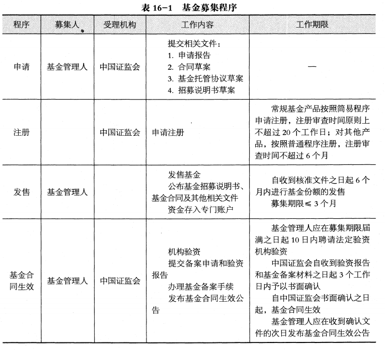
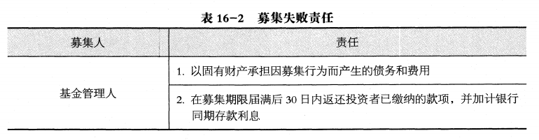
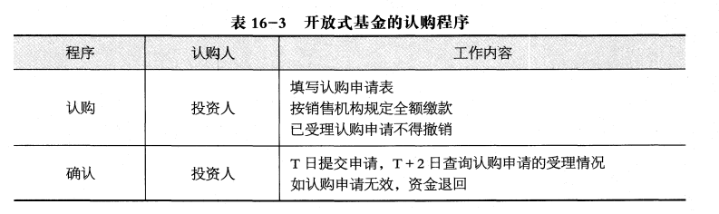
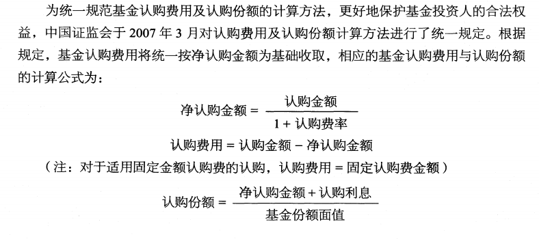
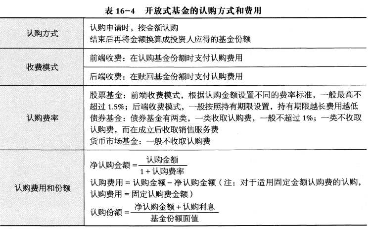
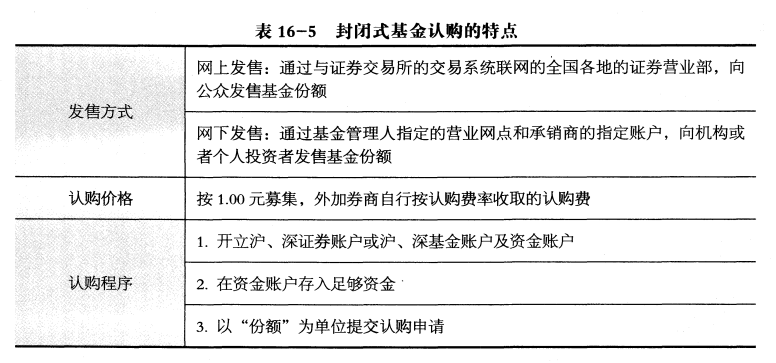
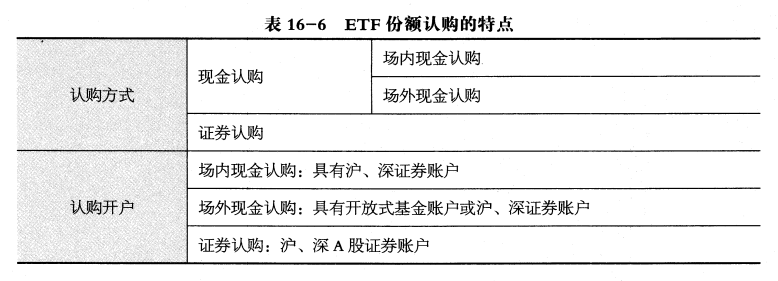
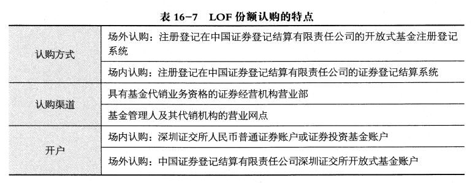
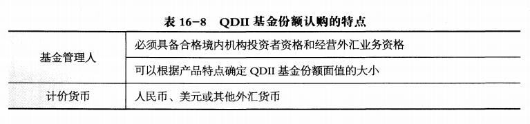
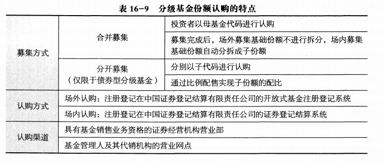

# 基金的募集、交易与登记

## 16.1 基金的募集与认购

> 掌握基金募集的概念、基金募集申请及注册、基金份额的发售

基金的募集是指基金管理公司根据有关规定向中国证监会提交募集申请文件、发售基金份额、募集基金的行为。

基金的募集一般要经过申请、注册、发售、基金合同生效等四个步骤。

**基金募集申请**

我国基金管理人进行基金的募集，必须依据《证券投资基金法》的有关规定，向中
国证监会提交相关文件。申请募集基金应提交的主要文件包括：基金募集申请报告、基
金合同草案、基金托管协议草案、招募说明书草案、律师事务所出具的法律意见书等。

基金募集申请报告包括但不限于：①基金有关注册条件的说明；②基金与本公司已获批产品及行业同类产品差异，以及对基金投资运作和投资者的影响评估；③其他需要监管机构特别关注事项。

对于复杂或者创新产品，中国证监会将根据基金的特征与风险，要求基金管理人补充提交证券交易所
和证券登记结算机构的授权函、投资者适当性安排、技术准备情况和主要业务环节的制度安排等文件。

申请材料受理后，相关内容不得随意更改。申请期间申请材料涉及的事项发生重大
变化的，基金管理人应当自变化发生之日起五个工作日内向中国证监会提交更新材料。

**基金募集申请的注册**

根据《证券投资基金法》的要求，中国证监会应当自受理基金募集申请之日起6个月内做出注册或者不予注册的决定。

中国证监会在基金注册审查过程中，可以委托基金业协会进行初步审查并就基金信息披露文件合规性提出意见，
或者组织专家评审会对创新基金募集申请进行评审，也可就特定基金的投资管理、销售安排、交易结算、登记托
管及技术系统准备情况等征求证券交易所、证券登记结算机构等的意见，供注册审查时参考。

基金募集申请经中国证监会注册后方可发售基金份额。

**基金份额的发售**

基金管理人应当自收到核准文件之日起6 个月内进行基金份额的发售。  
超过6个月开始募集，原注册的事项未发生实质性变化的，应当报国务院证券监督管理机构备案；
发生实质性变化的，应当向国务院证券监督管理机构重新提交注册申请。

基金的募集不得超过中国证监会核准的基金募集期限。基金的募集期限自基金份额发售之日起计算，募集期限一般不得超过3个月。

基金份额的发售，由基金管理人负责办理。基金管理人应当在基金份额发售的3日
前公布招募说明书、基金合同及其他有关文件。

在基金募集期间募集的资金应当存入专门账户，在基金募集行为结束前，任何人不
得动用。

**基金的合同生效**

> 掌握基金合同生效的条件

基金募集期限届满，封闭式基金需满足募集的基金份额总额达到核准规模的80%以上，并且基金份额持有人人数达到200人以上；  
开放式基金需满足募集份额总额不少于2亿份，基金募集金额不少于2亿元人民币，基金份额持有人的人数不少于200人。

基金管理人应当自募集期限届满之日起10日内聘请法定验资机构验资。自收到验
资报告之日起10日内，向中国证监会提交备案申请和验资报告，办理基金备案手续。

中国证监会自收到基金管理人验资报告和基金备案材料之日起3 个工作日内予以书
面确认；**自中国证监会书面确认之日起，基金备案手续办理完毕，基金合同生效。**
基金管理人应当在收到中国证监会确认文件的次日予以公告。

需要特别说明的是，发起式基金的基金合同生效不受上述条件的限制。  
发起式基金是指基金管理人在募集基金时，使用公司股东资金、公司固有资金、公司高级管理人员
或者基金经理等人员资金认购基金的金额不少于1 000万元人民币，且持有期限不少于3 年。
发起式基金的基金合同生效3 年后，若基金资产净值低于2 亿元的，基金合同自动终止。发起资金的持有期限自该基金公开发售之日或者合同生效之日孰晚日起计算。

基金募集期限届满，基金不满足有关募集要求的，基金募集失败，基金管理人
应承担下列责任：
1. 以固有财产承担因募集行为而产生的债务和费用；
2. 在基金募集期限届满后3 0 日内返还投资者已缴纳的款项，并加计银行同期存款利息。

> 了解基金产品注册制度改革

近年来，中国证监会不断推进基金产品注册制度改革，对基金募集的注册审查以
要件齐备和内容合规为基础，不对基金的投资价值及市场前景等作出实质性判断或者保
证，并将注册程序分为简易程序和普通程序。
1. 对常规基金产品，按照简易程序注册，注册审查时间原则上不超过20个工作日；  
2. 对其他产品，按照普通程序注册，注册审查时间不超过6个月。

适用于简易程序的产品包括常规股票基金、混合基金、债券基金、指数基金、货币基金、发起式基金、合格境内机构投资者（QDII) 基金、理财基金和交易型指数基金（含单市场、跨市场/跨 境 ETF) 及其联接基金。

分级基金、基金中基金（FOF)及中国证监会认定的其他特殊产品暂不实行简易程序。

> 掌握基金认购的概念、各类基金（开放式、封闭式、 ETF、 LOF、 QDII）的认购方式和程序

在基金募集期内购买基金份额的行为通常被称为基金的认购。

### 开放式基金的认购

**开放式基金的认购步骤**

投资人认购开放式基金，一般通过基金管理人或管理人委托的商业银行、证券公
司、期货公司、保险机构、证券投资咨询机构、独立基金销售机构以及经国务院证券监
督管理机构认定的其他机构办理

投资者进行认购时，如果没有在注册登记机构开立基金账户，需提前在注册登记机
构开立基金账户。基金账户是基金登记人为基金投资者开立的、用于记录其持有的基金
份额余额和变动情况的账户。

开放式基金的认购，分为认购和确认两个步骤。
1. 认购。投资人在办理基金认购申请时，须填写认购申请表，并需按销售机构规
定的方式全额缴款。投资者在募集期内可以多次认购基金份额。一般情况下，已经正式
受理的认购申请不得撤销。
2. 确认。销售机构对认购申请的受理并不代表该申请一定成功，而仅代表销售
机构确实接受了认购申请，申请的成功与否应以注册登记机构的确认结果为准。投资者
T 日提交认购申请后，一般可于T + 2日后到办理认购的网点查询认购申请的受理情况。
认购申请被确认无效的，认购资金将退回投资人资金账户。认购的最终结果要待基金募
集期结束后才能确认。

**开放式基金的认购方式**

开放式基金的认购采取金额认购的方式，即投资者在办理认购申请时，不是直接以认购数量提出申请，而是以金额申请。  
基金注册登记机构在基金认购结束后，再按基金份额的认购价格，将申请认购基金的金额换算为投资者应得的基金份额。

**开放式基金的认购费率和收费模式**

目前，我国股票型基金的认购费率一般按照认购金额设置不同的费率标准，最高一般不超过1.5%，债券型基金的认购费率通常在1 % 以下，货币型基金一般认购费为0。

在基金份额认购上存在两种收费模式：前端收费模式和后端收费模式。
1. 前端收费模式是指在认购基金份额时就支付认购费用的付费模式；
2. 后端收费模式是指在认购基金份额时不收费，在赎回基金份额时才支付认购费用的收费模式。

后端收费模式设计的目的是为鼓励投资者能够长期持有基金，因为后端收费的认购费率一般会随着投资时间的延
长而递减，甚至不再收取认购费用

**开放式基金认购费用与认购份额的计算**

### 封闭式基金的认购

封闭式基金份额的发售，由基金管理人负责办理。基金管理人一般会选择证券公司组成承销团代理基金份额的发售。
基金管理人应当在基金份额发售的3 日前公布招募说明书、基金合同及其他有关文件。

在发售方式上，主要有网上发售与网下发售两种方式。
1. 网上发售是指通过与证券交易所的交易系统联网的全国各地的证券营业部，向公众发售基金份额的发行方式。
2. 网下发售方式是指通过基金管理人指定的营业网点和承销商的指定账户，向机构或个人投资者发售基金份额的方式。

目前募集的封闭式基金通常为创新封闭式基金。创新型封闭式基金按1.00元募集，外加券商自行按认购费率收取认购费方式进行。  
拟认购封闭式基金份额的投资人必须开立沪、深证券账户或沪、深基金账户及资金账户，根据自己计划的认购量在资金账户中存入足够的资金，并 **以“份额”为单位提交认购申请**。认购申请已经受理就不能撤单。

### ETF基金的认购

与普通的开放式基金不同，根据投资者认购ETF份额所支付的对价种类， ETF份额的认购又可分为现金认购和证券认购。
1. 现金认购是指用现金换购ETF份额的行为
2. 证券认购是指用指定证券换购ETF份额的行为。

投资者一般可选择场内现金认购、场外现金认购以及证券认购等方式认购ETF份额。
1. 场内现金认购是指投资者通过基金管理人指定的基金发售代理机构以现金方式参与证券交易所网上定价发售。
2. 场外现金认购是指投资者通过基金管理人**及其**指定的发售代理机构以现金进行的认购。
3. 证券认购是指投资者通过基金管理人**及其**指定的发售代理机构对指定的证券进行认购

1. 投资者进行场内现金认购时需具有沪、深证券账户。
2. 投资者进行场外现金认购时需具有开放式基金账户或者沪、深证券账户。
3. 投资者进行证券认购时需具有沪、深 A 股证券账户。

### LOF基金的认购

目前，我国只有深圳证券交易所开办LOF业务，因此，本部分关于LOF的介绍主要以深圳证券交易所LOF的相关规则为准。

LOF份额的认购分场外认购和场内认购两种方式。
1. 场外认购的基金份额注册登记在中国证券登记结算有限责任公司的开放式基金注册登记系统。
2. 场内认购的基金份额注册登记在中国证券登记结算有限责任公司的证券登记结算系统。

基金募集期间，投资者
1. 可以通过具有基金代销业务资格的证券经营机构营业部场内认购LOF份额
2. 也可通过基金管理人**及其**代销机构的营业网点场外认购LOF份额。

1. 场内认购LOF份额，应持深圳证交所人民币普通证券账户或证券投资基金账户；
2. 场外认购LOF份额，应使用中国证券登记结算有限责任公司深圳证交所开放式基金账户。

### QDII基金的认购

QDII基金份额的认购程序与一般开放式基金基本相同，主要包括开户、认购、确认三个步骤。

QDII基金份额的认购渠道与一般开放式基金类似。在募集期间内，投资者应当在
基金管理人、代销机构办理基金发售业务的营业场所或按基金管理人、代销机构提供的
其他方式办理基金的认购

QDII基金主要投资于境外市场，因而与仅投资于境内证券市场的其他开放式基金
相比，在募集认购的具体规定上有如下几点独特之处：
1. 发售QDII基金的基金管理人必须具备合格境内机构投资者资格和经营外汇业务资格。
2. 基金管理人可以根据产品特点确定QDII基金份额面值的大小。
3. QDII基金份额除可以用人民币认购外，也可以用美元或其他外汇货币为计价货币认购。

### 分级基金份额的认购

我国分级基金的募集包括合并募集和分开募集两种方式。
1. 合并募集，是投资者以母基金代码进行认购。募集完成后，场外募集基础份额不进行拆分，场内募集基础份额在募集结束后自动分拆成子份额。
2. 分开募集，是分别以子代码进行认购，通过比例配售实现子份额的配比。

目前我国分开募集的分级基金仅限于债券型分级基金

与LOF类似，分级基金的认购包括场外认购和场内认购两种方式。
1. 场外认购的基金份额注册登记在中国证券登记结算有限责任公司的开放式基金注册登记系统。
2. 场内认购的基金份额注册登记在中国证券登记结算有限责任公司的证券登记结算系统。

目前，我国只有深圳证券交易所开办场内认购分级基金份额。

基金募集期间，投资者既可以通过具有基金销售业务资格的证券经营机构营业部场内认购分级基金份额，也可以通过基
金管理人及其销售机构的营业网点场外认购分级基金份额。

