# 基金的募集、交易与登记

## 16.2 基金的交易、申购和赎回

> 理解封闭式基金的上市与交易  

封闭式基金募集成立后，即安排在证券交易所上市，以使投资者获得流动性。

**上市交易条件：**
申请封闭式基金份额上市交易，应当经由基金管理人向证券交易所提出申请，证券
交易所依法审核同意的，双方应当签订上市协议。
- 基金的募集符合《证券投资基金法》规定；
- 基金合同期限为5 年以上；
- 基金募集金额不低于2 亿元人民币；
- 基金份额持有人不少于1 000人 ；
- 基金份额上市交易规则规定的其他条件。

**交易账户的开立**

投资者买卖封闭式基金必须开立沪、深证券账户或沪、深基金账户及资金账户。  
基金账户只能用于基金、国债及其他债券的认购及交易

个人投资者开立基金账户需持本人身份证到证券登记机构办理开户手续。办理资金
账户需持本人身份证和已经办理的股票账户卡或基金账户卡，到证券经营机构办理。每
个有效证件只允许开设一个基金账户，已开设证券账户的不能再重复开设基金账户。每
位投资者只能开设和使用一个资金账户，并只能对应一个股票账户或基金账户。

**交易规则**

封闭式基金发行结束后，不能按基金净值买卖，投资者可委托券商（证券公司）在
证券交易所按市价（二级市场）买卖，直到到期日。

封闭式基金的交易时间为每周一至周五（法定公众节假日除外），每 天 9 :30-11: 30， 13:00-15:00

封闭式基金的交易遵从“价格优先、时间优先”的原则。
- 价格优先是指较高价格买进申报优先于较低价格买进申报
- 较低价格卖出申报优先于较高价格卖出申报。
- 时间优先是指买卖方向、价格相同的，先申报者优先于后申报者。先后顺序按交易主机接受申报的时间确定

封闭式基金的报价单位为每份基金价格。基金的申报价格最小变动单位为0.001元
人民币。买入与卖出封闭式基金份额，申报数量应当为100份或其整数倍。基金单笔最大数量应当低于100万份。

目前，沪、深证券交易所对封闭式基金的交易与股票交易一样实行价格涨跌幅限制，涨跌幅比例为10% (基金上市首日除外）。  
同时，我国封闭式基金在达成交易后，二级市场交易份额和股份的交割是在T + 0 日，资金交割是在T + 1 日完成。

**交易费用**

按照沪、深证券交易所公布的收费标准，我国基金交易佣金不得高于成交金额的
0.3% (深圳证券交易所特别规定该佣金水平不得低于代收的证券交易监管费和证券交易
经手费，上海证券交易所无此规定），起 点 5 元 ，不 足 5 元的按5 元收取，由证券公司向投资者收取。该项费用由证券登记公司与证券公司平分。  
目前，在沪、深证券交易所上市的封闭式基金交易不收取印花税。

**折(溢)价率**

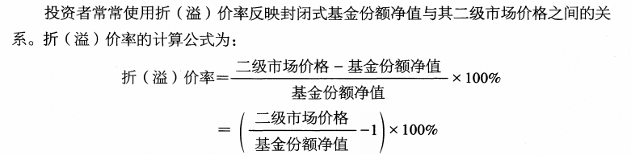

- 当基金二级市场价格高于基金份额净值时，为溢价交易，对应的是溢价率；
- 当二级市场价格低于基金份额净值时，为折价交易，对应的是折价率。

当折价率较高时常常被认为是购买封闭式基金的好时机，但实际上并不尽然。有时折价率会继续攀升，在弱市时更有可能出现价格与净值同步下降的情形。

**总结**

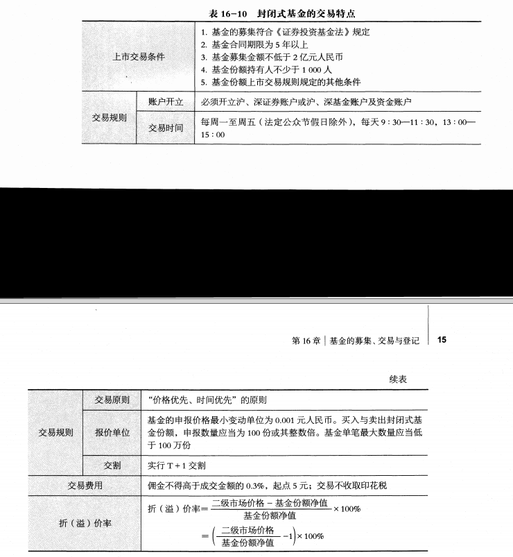

> 掌握开放式基金申购与赎回的概念  

**封闭期及基金开放申购和赎回**

开放式基金的基金合同生效后，可有一段短暂的封闭期。根据中国证监会《公开募
集证券投资基金运作管理办法》规定，开放式基金合同生效后，可以在基金合同和招募
说明书规定的期限内不办理赎回，但该期限最长不超过3个月。

封闭期结束后，开放式基金将进入日常申购、赎回期。  
基金管理人应当在每个工作日办理基金份额的申购、赎回业务。基金合同另有约定的，按照其约定。

投资者在开放式基金合同生效后，申请购买基金份额的行为通常被称为基金的申购。

基金认购与基金申购略有不同， 一般区别在于：
1. 认购费一般低于申购费，在基金募集期内认购基金份额，一般会享受到一定的费率优惠。
2. 认购是按1元进行认购，而申购通常是按未知价确认。
3. 认购份额要在基金合同生效时确认，并且有封闭期；而申购份额通常在T + 2 日之内确认，确认后的下一工作日就可以赎回。

开放式基金的赎回是指基金份额持有人要求基金管理人购回所持有的开放式基金份额的行为。

**开放式基金的申购和赎回原则**

股票基金、债券基金的申购和赎回原则：
1. 未知价交易原则
2. 金额申购、份额赎回原则

开放式基金招募说明书中过去一般规定申购申报单位为1 元人民币，申购金额应当为1 元的整数倍，且不低于1 000元；  
赎回申报单位为1 份基金份额，赎回应当为整数份额，但现在这一规定逐渐取消

货币市场基金的申购和赎回原则：
1. 确定价原则。货币市场基金申购和赎回基金份额价格以1 元人民币为基准进行计算。
2. 金额申购、份额赎回原则。货币市场基金申购以金额申请，赎回以份额申请。

**开放式基金申购和赎回的场所及时间**

开放式基金的申购和赎回与认购渠道一样，可以通过基金管理人的直销中心与基金销售代理网点进行。  
投资者也可通过基金管理人或其指定的基金销售代理人以电话、传真或互联网等形式进行申购和赎回

基金管理人应在申购和赎回开放日前3 个工作日在至少一种中国证监会指定的媒体上刊登公告。  
申购和赎回的工作日为证券交易所交易日，具体业务办理时间为上海证券交易所、深圳证券交易所的交易时间。  
目前，上海证券交易所、深圳证券交易所的交易时间为 9:30—11:30和13:00—15:00。

> 掌握开放式基金申购与赎回的费用结构  

**申购和赎回的费用及销售服务费**

投资者在办理开放式基金申购时， 一般需要缴纳申购费，和认购费一样，申购费可
以采用在基金份额申购时收取的前端收费方式，也可以采用在赎回时从赎回金额中扣除的后端收费方式。
- 前端收费方式下，基金管理人可以选择根据投资人申购金额分段设置申购费率。
- 后端收费方式下，基金管理人可以选择根据投资人持有期限不同分段设置申购费，对于持有期低于3 年的投资人，基金管理人不得免收其后端申购费。

基金销售机构可以对基金销售费用实行一定的优惠

基金管理人办理开放式基金份额的赎回，应当收取赎回费。  
- 场外赎回可按份额在场外的持有时间分段设置赎回费率；
- 场内赎回为固定赎回费率，不可按份额持有时间分段设置赎回费率。

赎回费在扣除手续费后，余额不得低于赎回费总额的25%，并应当归入基金财产。

目前对于一般的股票型和混合型基金赎回费归基金财产的比例有以下规定：
- 不收取销售服务费的，对持续持有期少于7 日的投资人收取不低于1.5%的赎回费
- 对持续持有期少于3 0 日的投资人收取不低于0.75%的赎回费，并将上述赎回费全额计入基金财产；
- 对持续持有期少于3 个月的投资人收取不低于0.5%的赎回费，并将不低于赎回费总额的75% 计入基金财产；
- 对持续持有期长于3 个月但少于6 个月的投资人收取不低于0.5%的赎回费，并将不低于赎回费总额的50% 计入基金财产；
- 对持续持有期长于6 个月的投资人，应当将不低于赎回费总额的25% 计入基金财产。

对于交易型开放式指数基金（ETF)、上市开放式基金（LOF)、分级基金、指数基
金、短期理财产品基金等股票基金、混合基金以及其他类别基金，基金管理人可以参照
上述标准在基金合同、招募说明书中约定赎回费的收取标准和计入基金财产的比例，不作强制要求。

基金管理人可以从开放式基金财产中计提一定比例的销售服务费，用于基金的持续销售和给基金份额持有人提供服务

**申购份额及赎回金额的计算**

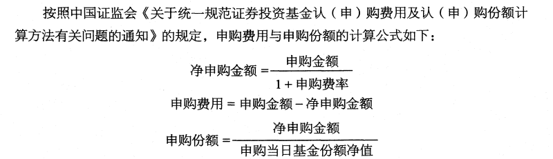

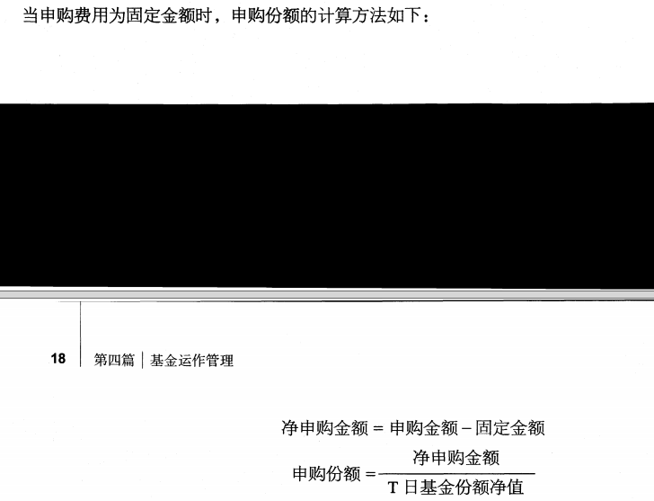

一般规定基金份额份数以四舍五入的方法保留小数点后两位以上，由此产生误差的损失由基金资产承担，产生的收益归基金资产所有，
但不同的基金招募说明书中约定不一样，有些也采用“基金份额小数点两位以后部分舍去”的方式。

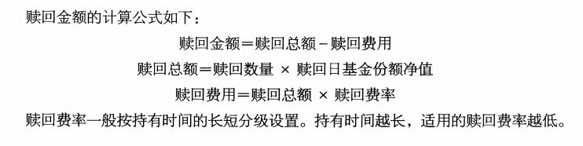

实行后端收费模式的基金，还应扣除后端认购/ 申购费，才是投资者最终得到的赎回金额。即：`赎回金额=赎回总额-赎回费用-后端收费金额`

**货币市场基金手续费较低，通常申购和赎回费率为0。** 一般地，货币市场基金从基金财产中计提比例不高于0.25%的销售服务费，用于基金的持续销售和给基金份额持有人提供服务。

**开放式基金申购和赎回登记及款项的支付**

投资人申购基金份额时，必须**全额交付申购款项**（中国证监会另有规定的基金除外 ），投资人按规定提交申购申请并全额交付款项的，申购申请即为成立；  
基金份额登记机构确认基金份额时，申购生效。基金份额持有人递交赎回申请，赎回成立；基金份额登记机构确认赎回时，赎回生效。

一般而言，投资者申购基金成功后，登记机构会在 T + 1 日为投资者办理增力卩权益的登记手续，投资者自T + 2 日起有权赎回该部分基金份额。

投资者赎回申请成交后，基金管理人应通过销售机构按规定向投资者支付赎回款项。
对一般基金而言，基金管理人应当自受理基金投资者有效赎回申请之日起7 个工作曰内支付赎回款项（具体根据基金品种和托管银行的处理速度存在不同）。
投资者赎回基金份额成功后，登记机构一般在T + 1 日为投资者办理扣除权益的登记手续

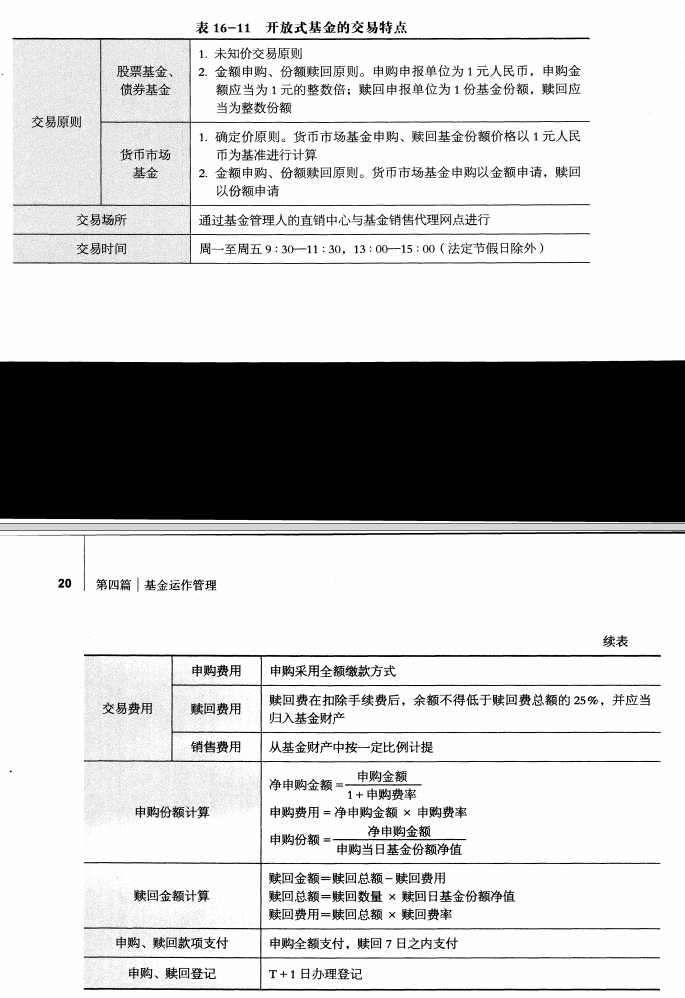

> 理解开放式基金巨额赎回的认定及处理  

**开放式基金巨额赎回的认定及处理**

单个开放曰基金净赎回申请超过基金总份额的10% 时，为巨额赎回。  
单个开放日的净赎回申请，是指该基金的赎回申请加上基金转换中该基金的转出申请之和，扣除当日发生的该基金申购申请及基金转换中该基金的转入申请之和后得到的余额。

出现巨额赎回时，基金管理人可以根据基金当时的资产组合状况决定接受全额赎回或部分延期赎回。
1. 接受全额赎回。当基金管理人认为有能力兑付投资者的全额赎回申请时，按正常赎回程序执行。
2. 部分延期赎回。当基金管理人认为兑付投资者的赎回申请有困难，或认为兑付投资者的赎回申请进行的资产变现可能使基金份额净值发生较大波动时，基金管理人可以在当日接受赎回比例不低于上一日基金总份额10%的前提下，对其余赎回申请延期办理。

对单个基金份额持有人的赎回申请，应当按照其申请赎回份额占申请赎回总份额的比例确定该单个基金份额持有人当日办理的赎回份额。  
未受理部分除投资者在提交赎回申请时选择将当日未获受理部分予以撤销外，延迟至下一开放日办理。转入下一开放日的赎回申请不享有赎回优先权，并将以下一个开放日的基金份额净值为基准计算赎回金额。以此类推，直到全部赎回为止。

当发生巨额赎回及部分延期赎回时，基金管理人应立即向中国证监会备案，并 在 3
个工作日内在至少一种中国证监会指定的信息披露媒体公告，并说明有关处理方法。

基金连续2 个开放日以上发生巨额赎回，如基金管理人认为有必要，可暂停接受赎回申请；  
已经接受的赎回申请可以延缓支付赎回款项，但不得超过正常支付时间20个工作日，并应当在至少一种中国证监会指定的信息披露媒体公告。

> 理解开放式基金转换和非交易过户、份额和金额计算等  

**开放式基金份额的转换、非交易过户、转托管与冻结**

**开放式基金份额的转换**是指投资者不需要先赎回已持有的基金份额，就可以将其持有的基金份额转换为同一基金管理人管理的另一基金份额的一种业务模式。

基金份额的转换一般采取未知价法，按照转换申请日的基金份额净值为基础计算转换基金份额数量。

由于基金的申购和赎回费率不同，当转入基金的申购费率高于转出基金的申购费率而存在费用差额时，一般应在转换时补齐。此外，基金份额的转换常常还会收取一定的转换费用。尽管如此，由于基金份额的转换不需要先赎回已持有的基金再购买另一基金，因此综合费用仍较低。

**开放式基金非交易过户**是指不采用申购、赎回等基金交易方式，将一定数量的基金份额按照一定规则从某一投资者基金账户转移到另一投资者基金账户的行为，主要包括
继承、司法强制执行等方式。接受划转的主体必须是合格的个人投资者或机构投资者

**基金持有人可以办理其基金份额在不同销售机构的转托管手续。** 
转托管在转出方进行申报，基金份额转托管一次完成。一般情况下，投资者于T 日转托管基金份额成功
后 ，转托管份额于T + 1 日到达转入方网点，投资者可于T + 2 日起赎回该部分基金份额。

**基金注册登记机构只受理国家有权机关依法要求的基金账户或基金份额的冻结与解冻**。基金账户或基金份额被冻结的，被冻结部分产生的权益（包括现金分红和红利再投资 ）一并冻结。

> 理解 ETF、 LOF 和 QDII 的交易方式与流程  

### ETF的上市交易与申购赎回

基金合同生效后，基金管理人应逐步调整实际组合直至达到跟踪指数要求，此过程
为ETF建仓阶段。 ETF建仓期不超过3个月。

基金建仓期结束后，为方便投资者跟踪基金份额净值变化，基金管理人通常会以某一选定日期作为基金份额折算日，
以标的指数的( 或 1 % )作为份额净值，对原来的基金份额及其净值进行折算

ETF基金份额折算由基金管理人办理，并由登记结算机构进行基金份额的变更登记。

基金份额折算后，基金份额总额与基金份额持有人持有的基金份额将发生调整，但调整后的基金份额持有人持有的基金份额占基金份额总额的比例不发生变化。
基金份额折算对基金份额持有人的收益无实质性影响。基金份额折算后，基金份额持有人将按照折算后的基金份额享有权利并承担义务。

**ETF基金份额折算的方法**

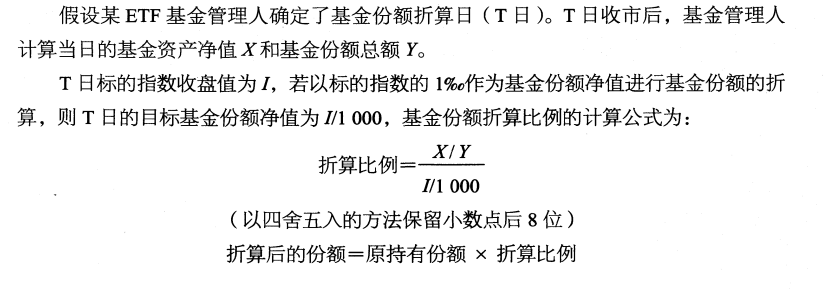

ETF基金合同生效后，基金管理人可向证券交易所申请上市。 ETF上市后二级市场的交易与封闭式基金类似，要遵循下列交易规则：
1. 基金上市首日的开盘参考价为前一工作日基金份额净值；
2. 基金实行价格涨跌幅限制，涨跌幅比例为10% ，自上市首日起实行；
3. 基金买入申报数量为100份或其整数倍，不足100份的部分可以卖出；
4. 基金申报价格最小变动单位为0.001元。

基金管理人在每一交易日开市前需向证券交易所提供当日的申购、赎回清单。证券
交易所在开市后根据申购、赎回清单和组合证券内各只证券的实时成交数据，计算并每
15秒发布一次基金份额参考净值（IOPV)，供投资者交易、申购、赎回基金份额时参考

基金管理人将在开始申购、赎回业务前公告申购、赎回代理证券公司（上海证券
交 易 所 称 为 “代理证券公司”，深圳证券交易所称为“代办证券公司”，可以统一称为“参与券商”）的名单
- 投资者应当在参与券商办理基金申购、赎回业务的营业场所或按参与券商提供的其他方式办理基金的申购和赎回。
- 部分ETF基金管理人还提供场外申购赎回模式，投资者可以采用现金方式，通过场外申购赎回代理机构办理申购赎回业务。

**申购和赎回的时间**
1. 申购和赎回的开始时间。在基金份额折算日之后可开始办理申购ETF基金。自基金合同生效日后不超过3 个月的时间起开始办理赎回。
2. 开放日及开放时间。投资者可办理申购、赎回等业务的开放日为证券交易所的交易日，开放时间为9:30—11:30和13:00—15:00, 除此时间之外不办理基金份额的申购和赎回。

**申购和赎回的数额限制**

投资者申购和赎回的基金份额需为最小申购和赎回单位的整数倍。我国ETF的最
小申购和赎回单位一般为50万份或100万份。基金管理人有权对其进行更改，并在更
改前至少3 个工作日在至少一种中国证监会指定的信息披露媒体公告。

基金管理人应于申购开始日和赎回开始日前至少3 个工作日在至少一种证监会指定的信息披露媒体公告。

**申购和赎回的原则**
- 场内申购和赎回ETF采用份额申购、份额赎回的方式，即申购和赎回均以份额申请。
- 场外申购赎回采用金额申购、份额赎回的方式，即申购以金额申请，赎回以份额申请
- 场内申购赎回ETF的申购对价和赎回对价包括组合证券、现金替代、现金差额及其他对价。场外申购赎回ETF时，申购对价和赎回对价均为现金。
- 申购和赎回申请提交后不得撤销

**申购和赎回的程序**

1. 申购和赎回申请的提出。投资者须按申购和赎回参与券商规定的手续，在开放
日的开放时间提出申购和赎回的申请。投资者申购基金时需根据申购和赎回清单备足相
应数量的股票和现金。投资者提交赎回申请时必须持有足够的基金份额余额和现金。
2. 申购和赎回申请的确认与通知。基金投资者的申购和赎回申请在受理当日进行
确认。如投资者未能提供符合要求的申购对价，则申购申请失败。如投资者持有的、符
合要求的基金份额不足，或未能根据要求准备足额的现金，或基金投资组合内不具备足
额的符合要求的赎回对价，则赎回申请失败。投资者可在申请当日通过其办理申购和赎
回的销售网点查询确认情况。
3. 申购和赎回的清算交收与登记。目前，单市场ETF基金的清算交收是按照投资者T日申购和赎回成功后
    - 登记结算机构在T日收市后为投资者办理基金份额与组合证券的清算交收以及现金替代等的清算。
    - 在T+1日办理现金替代等的交收以及现金差额的清算；
    - 在T+2日办理现金差额的交收，并将结果发送给申购和赎回参与券商、基金管理人和基金托管人。

如果登记结算机构在清算交收时发现不能正常履约的情形，则依据《中国证券登记结算有限责任公司交易型开放式指数基金登记结算业务实施细则》的有关规定进行处理。

登记结算机构可在法律法规允许的范围内，对清算交收和登记的办理时间、方式进行调整，并最迟于开始实施前3 个工作日在至少一种中国证监会指定的信息披露媒体公告。

**申购和赎回的对价、费用及价格**
1. 场内申购和赎回时，申购对价是指投资者申购基金份额时应交付的组合证券、现金替代、现金差额及其他对价；
2. 赎回对价是指投资者赎回基金份额时，基金管理人应交付给赎回人的组合证券、现金替代、现金差额及其他对价。
3. 申购对价、赎回对价根据申购、赎回清单和投资者申购、赎回的基金份额确定。
4. 场外申购和赎回时，申购对价和赎回对价均为现金。

投资者在申购或赎回基金份额时，**申购或赎回参与券商可按照0.5%的标准收取佣金**，其中包含证券交易所、登记结算机构等收取的相关费用。

T的基金份额净值在当天收市后计算，并在T+1日公告，计算公式为计算日基金资产净值除以计算日发售在外的基金份额总数。  
T日的申购、赎回清单在当日上海证券交易所开市前公告。如遇特殊情况，可以适当延迟计算或公告，并报中国证监会备案。

**申购清单和赎回清单**

1. 申购清单和赎回清单的内容。 T日申购清单和赎回清单公告内容包括最小申购、赎回单位所对应的组合证券内各成分证券数据、现金替代、T日预估现金部分、 T-1日现金差额、基金份额净值及其他相关内
容。
2. 组合证券相关内容。组合证券是指基金标的指数所包含的全部或部分证券。申购清单和赎回清单将公告最小申购、赎回单位所对应的各成分证券名称、证券代码及数量。
3. 现金替代相关内容。现金替代是指申购和赎回过程中，投资者按基金合同和招募说明书的规定，用于替代组合证券中部分证券的一定数量的现金。
采用现金替代是为了在相关成分股股票停牌等情况下便利投资者的申购，提高基金运作的效率。
基金管理人在制定具体的现金替代方法时遵循公平、公开的原则，以保护基金份额持有人利益为出发点，并进行及时充分的信息披露。
现金替代分为三种类型：
    - 禁止现金替代，是指在申购和赎回基金份额时，该成分证券不允许使用现金作为替代。
    - 可以现金替代，是指在申购基金份额时，允许使用现金作为全部或部分该成分证券的替代，但在赎回基金份额时，该成分证券不允许使用现金作为替代。
    - 必须现金替代，是指在申购和赎回基金份额时，该成分证券必须用现金作为替代。必须现金替代的证券一般是由于标的指数调整，即将被剔除的成分证券。对于必须现金替代的证券，基金管理人将在申购清单和赎回清单中公告替代的一定数量的现金，即“固定替代金额”。`固定替代金额=申购清单和赎回清单中该证券的数量x该证券经除权调整的T-1日收盘价`
4. 预估现金部分相关内容。预估现金部分是指为便于计算基金份额参考净值及申购和赎回，参与券商预先冻结申请申购、赎回的投资者的相应资金，由基金管理人计算的现金数额。
    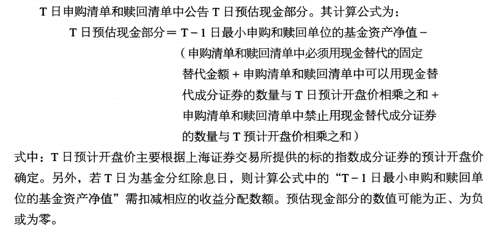
5. 现金差额相关内容。 T日现金差额在T+1日的申购清单和赎回清单中公示
    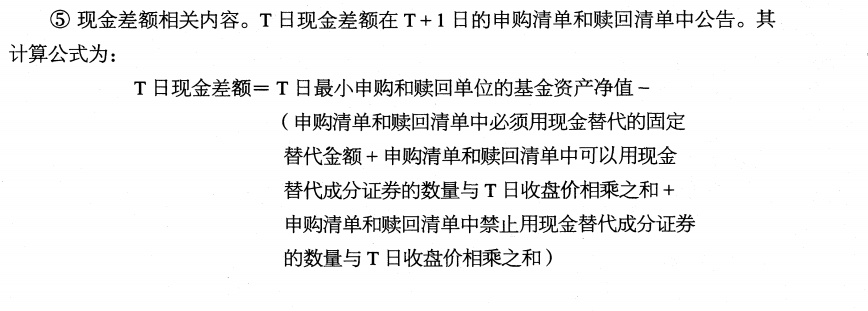

可以现金替代的证券一般是由于停牌等原因导致投资者无法在申购时买入的证券。  
对于可以现金替代的证券，替代金额的计算公式为：`替代金额=替代证券数量x该证券最新价格x(1+现金替代溢价比例)`

最新价格的确定原则为：
1. 该证券正常交易时，采用最新成交价； 
2. 该证券正常交易中出现涨停时，采用涨停价格；
3. 该证券停牌且当日有成交时，采用最新成交价;
4. 该证券停牌且当日无成交时，采用前一交易日收盘价。

现金替代溢价又被称为“现金替代保证”。收取现金替代溢价的原因是，对于使用
现金替代的证券，基金管理人需在证券恢复交易后买入，而实际买入价格加上相关交易
费用后与申购时的最新价格可能有所差异。为便于操作，基金管理人在申购、赎回清单
中预先确定现金替代溢价比例，并据此收取现金替代金额。如果预先收取的金额高于基
金购入该部分证券的实际成本，则基金管理人将退还多收取的差额；如果预先收取的金
额低于基金购入该部分证券的实际成本，则基金管理人将向投资者收取欠缺的差额。

T 曰投资者申购和赎回基金份额时，需按T+1日公告的T日现金差额进行资金的清算交收。现金差额的数值可能为正、为负或为零。
- 在投资者申购时，如现金差额为正数，则投资者应根据其申购的基金份额支付相应的现金；如现金差额为负数，则投资者将根据其申购的基金份额获得相应的现金。
- 在投资者赎回时，如现金差额为正数，则投资者将根据其赎回的基金份额获得相应的现金；如现金差额为负数，则投资者应根据其赎回的基金份额支付相应的现金。

出现如下情况，基金管理人可以暂停接受投资者的申购和赎回申请：
1. 不可抗力导致基金无法接受申购和赎回；
2. 证券交易所决定临时停市，导致基金管理人无法计算当日基金资产净值；
3. 证券交易所、申购和赎回参与券商、登记结算机构因异常情况无法办理申购和赎回；
4. 法律法规规定或经中国证监会批准的其他情形。

在发生暂停申购和赎回的情形之一时，基金的申购和赎回可能同时暂停。发生上述情形之一的，基金管理人应当在当日报中国证监会备案，并及时公告。  
在暂停申购和赎回的情况消除时，基金管理人应及时恢复申购和赎回业务的办理，并予以公告

**总结**

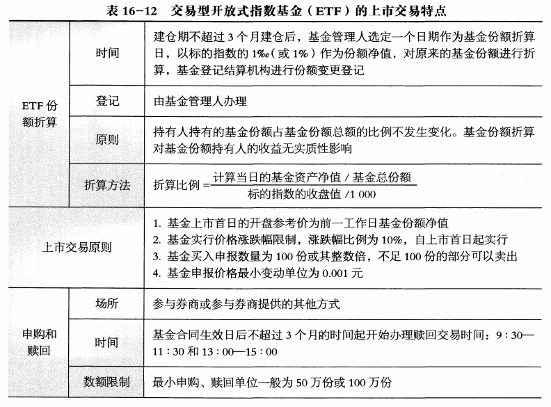

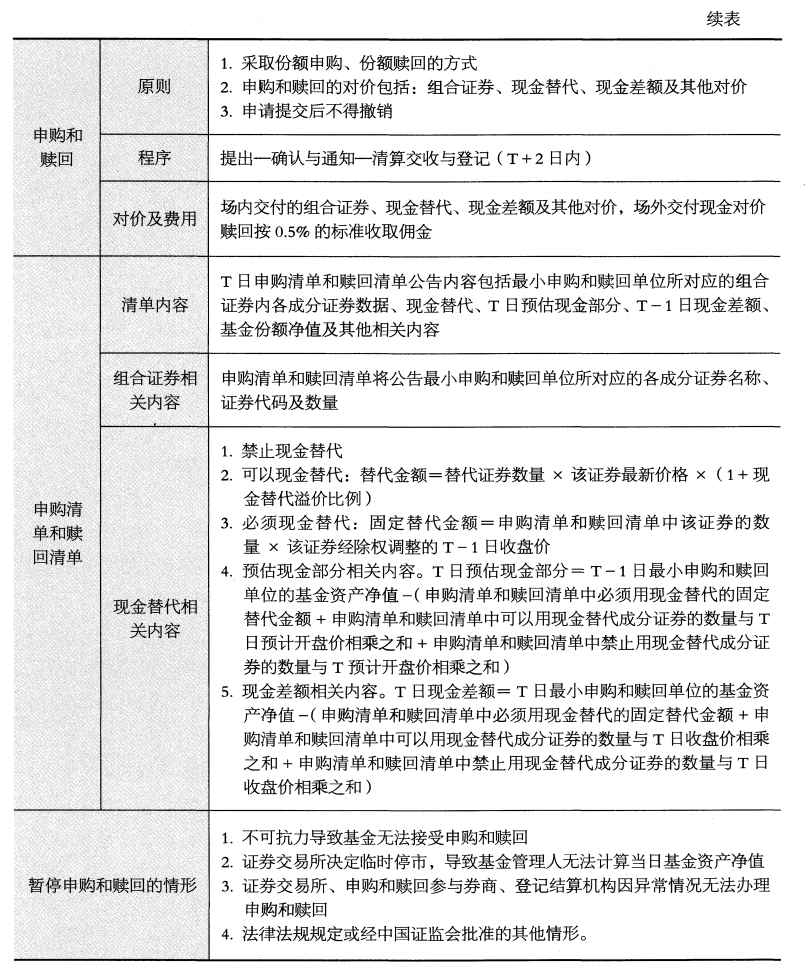

> 了解基金市场创新产品的上市交易及申购、赎回