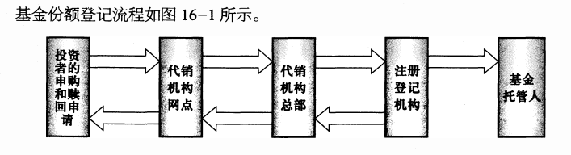

# 基金的募集、交易与登记

## 16.3 基金的登记

> 理解基金份额登记的概念

开放式基金份额的登记，是指基金注册登记机构通过设立和维护基金份额持有人名册 ，确认基金份额持有人持有基金份额的事实的行为。

基金份额登记具有确定和变更基金份额持有人及其权利的法律效力，是保障基金份额持有人合法权益的重要环节。

> 了解我国开放式基金现行登记模式

我国开放式基金注册登记体系的模式：
1. 基金管理人自建注册登记系统的“内置”模式；
2. 委托中国证券登记结算有限责任公司作为注册登记机构的“外置”模式；
3. 以上两种情况兼有的“混合”模式。

基金注册登记机构的主要职责
1. 建立并管理投资者基金份额账户；
2. 负责基金份额登记，确认基金交易；
3. 发放红利；
4. 建立并保管基金投资者名册；
5. 基金合同或者登记代理协议规定的其他职责。

> 掌握登记机构职责和基金份额登记流程

基金份额登记过程实际上是基金注册登记机构通过基金注册登记系统对基金投资者
所投资基金份额及其变动的确认、记账的过程。

这个过程与基金的申购和赎回过程是一致的，具体流程如下：
1. T 日，投资者的申购和赎回申请信息通过代销机构网点传送至代销机构总部，由代销机构总部将本代销机构的申购和赎回申请信息汇总后统一传送至注册登记机构。
2. T + 1 日，注册登记机构根据T 日各代销机构的申购和赎回申请数据及T 日的基金份额净值统一进行确认处理，并将确认的基金份额登记至投资者的账户，然后将确认后
的申购和赎回数据信息下发至各代销机构，各代销机构再下发至各所属网点。同时，注册登记机构也将登记数据发送至基金托管人。至此，注册登记机构完成对基金份额持有
人的基金份额登记。如果投资者提交的信息不符合注册登记的有关规定，最后的确认信息将是投资者申购和赎回失败。

对于不同基金品种，份额登记时间可能不一样， 一般基金通常如上所述，是 T+1日登记，而 QDII基金则通常是T+2日登记。

**申购和赎回的资金结算**

资金结算分清算和交收两个环节
1. 清算是按照确定的规则计算出基金当事各方应收应付资金数额的行为。
2. 交收是基金当事各方根据确定的清算结果进行资金的收付，从而完成整个交易过程。

基金份额申购和赎回的资金清算是注册登记机构根据确认的投资者申购和赎回数据信息进行的。

按照清算结果，投资者的申购和赎回资金将会从
- 投资者的资金账户转移至基金在托管银行开立的银行存款账户
- 或从基金的银行存款账户转移至投资者的资金账户。

由于基金申购和赎回的资金清算依据注册登记机构的确
认数据进行，为保护基金投资人的利益，有关法规明确规定，
基金管理人应当自收到投资者的申购（认购）、赎回申请之日
起 3 个工作日内，对该申购（认购）、赎回申请的有效性进行确认。

目前，我国境内基金申购款一般能在T + 2 日内到达基金的银行存款账户，赎回款一般于T + 3 日内从基金的银行存款账户划出。
货币市场基金的赎回资金划付更快一些，一般 T + 1 日即可从基金的银行存款账户划出，最快可在划出当天到达投资者资金账户