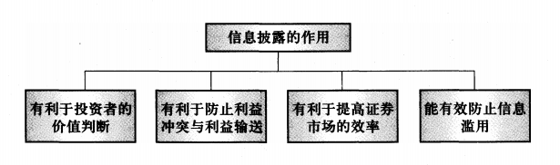
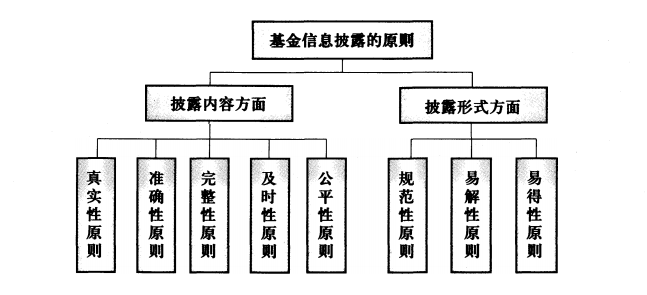
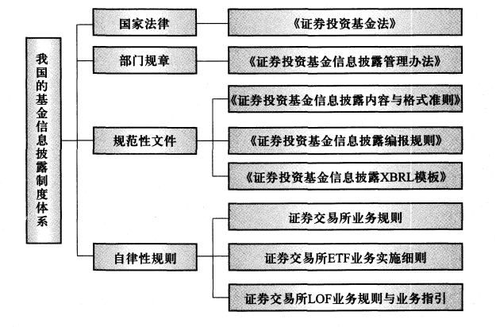

# 基金的信息披露

### 20.1 基金信息披露概述

> 掌握基金信息披露的作用、原则和内容

资本市场的基础是信息披露，监管的主要内容之一就是对信息披露的监管。

真实、准确、完整、及时的基金信息披露是树立整个基金行业公信力的基石。

基金信息披露是指基金市场上的有关当事人在**基金募集、上市交易、投资运作**等一
系列环节中，依照法律法规规定向社会公众进行的信息披露。

**基金信息披露的作用**主要表现在四个方面

**基金信息披露的原则**

及时性原则要求以最快的速度公开信息，体现在基金管理人应在法定期限内披露基金招募说明书、定期报告等文件，在重大事件发生之日起2日内披露临时报告。

基金信息披露的原则体现在对披露内容和披露形式两方面的要求上。
1. 在披露内容上，要求遵循真实性原则、准确性原则、完整性原则、及时性原则和公平性原则；
2. 在披露形式上，要求遵循规范性原则、易解性原则和易得性原则。

> 掌握基金信息披露的禁止性行为  
> 了解我国基金信息披露体系及 XBRL 的应用

**基金信息披露制度体系**

我国的基金信息披露制度体系可分为**国家法律、部门规章、规范性文件与自律规则**四个层次

虚假记载、误导性陈述和重大遗漏等三类行为将扰乱市场正常秩序，侵害投资者合法权益，属于严重的违法行为。

**基金信息披露的内容**
1. 基金招募说明书；
2. 基金合同；
3. 基金托管协议；
4. 基金份额发售公告；
5. 基金募集情况；
6. 基金合同生效公告；
7. 基金份额上市交易公告书；
8. 基金资产净值、基金份额净值；
9. 基金份额申购、赎回价格；
10. 基金定期报告，包括基金年度报告、基金半年度报告和基金季度报告；
11. 临时报告；
12. 基金份额持有人大会决议；
13. 基金管理人、基金托管人的基金托管部门的重大人事变动；
14. 涉及基金管理人、基金财产、基金托管业务的诉讼；
15. 澄清公告；
16. 中国证监会规定的其他信息。

**基金信息披露的禁止行为**

为了防止信息误导给投资者造成损失，保护公众投资者的合法权益，维护证券市场的正常秩序，法律法规对于借公开披露基金信息为名编制、传播虚假基金信息，恶意进行信息误导，诋毁同行或竞争对手等行为做出了禁止性规定
1. 虚假记载、误导性陈述或者重大遗漏
2. 对证券投资业绩进行预测
3. 违规承诺收益或者承担损失(如果基金信息披露中违规承诺收益或承担损失，则将被视为对投资者的诱骗及进行不当竞争。)
4. 诋毁其他基金管理人、基金托管人或者基金销售机构
5. 登载任何自然人、法人或者其他组织的祝贺性、恭维性或推荐性的文字
6. 中国证监会禁止的其他行为。

**XBRL在基金信息披露中的应用**

XBRL (extensible Business Reporting Language，可扩展商业报告语言）是国际上将
会计准则与计算机语言相结合，用于非结构化数据，尤其是财务信息交换的最新公认标
准和技术。通过对数据统一进行特定的识别和分类，可直接为使用者或其他软件所读取及进一步处理，实现一次录入、多次使用。

2008年12 月美国证券交易委员会采纳了一项法规，要求美国500家大型上市公司从 2009年中期开始利用XBRL报送财务报告，
要求共同基金从2011年 1 月 1 日开始利用XBRL报送基金招募说明书中的风险和收益信息。

在我国，上市公司自2003年年底就开始尝试应用XBRL报送定期报告，至今已持续10多年时间。
基金公司自2008年也启动了信息披露的XBRL应用工作，至今已实现了净值公告、部分临时公告和季度报告、半年度报告、年度报告等定期报告的XBRL报送。

总的来说，XBRL(可扩展商业报告语言)在基金信息披露中的应用将有利于促进信息披露的规范化、透明化和**电子化**，提高信息编报、传送和使用的效率与质量。