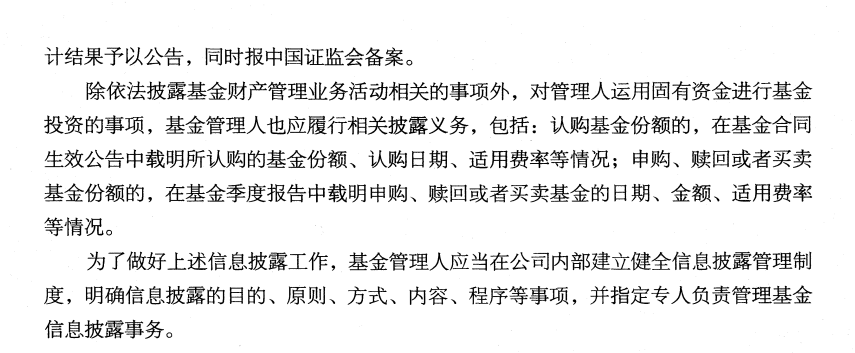
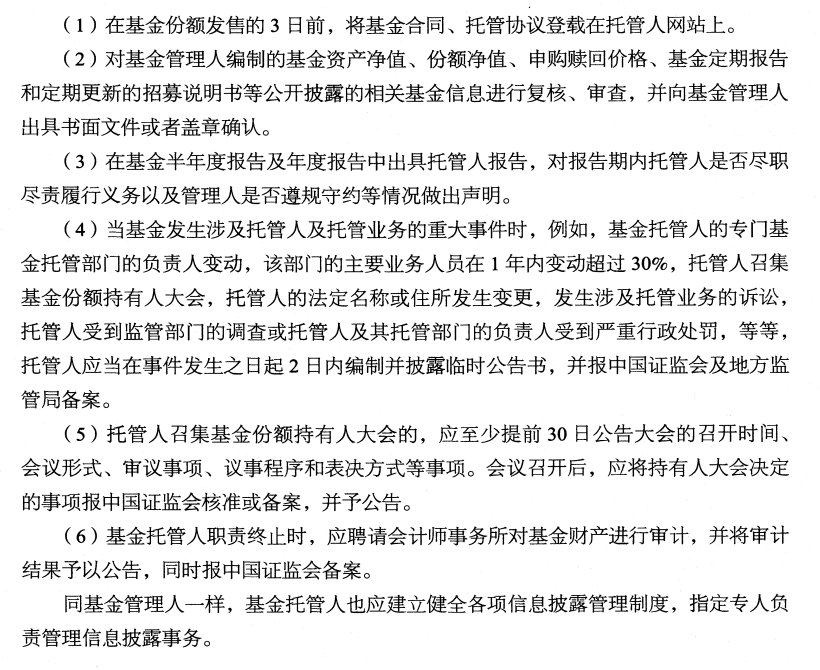
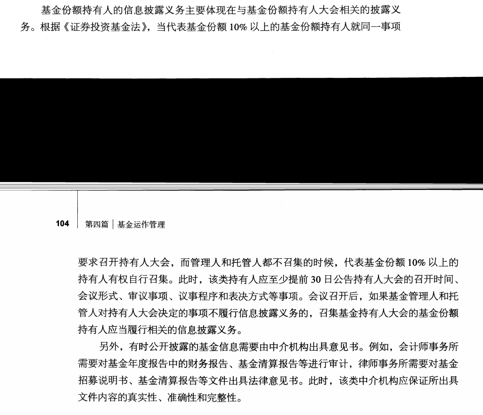

# 基金的信息披露

### 20.2 基金主要当事人的信息披露义务

在基金募集和运作过程中，负有信息披露义务的当事人主要有
1. 基金管理人
2. 基金托管人
3. 召集基金份额持有人大会的基金份额持有人。

他们应当依法及时披露基金信息，并保证所披露信息的真实性、准确性和完整性。

> 理解基金管理人信息披露的主要内容

对于基金管理人来说，主要负责办理与基金财产管理业务活动有关的信息披露事
项 ，具体涉及基金募集、上市交易、投资运作、净值披露等各环节

会计师事务所需要对基金年度报告中的财务报告、基金清算报告等进行审计，律师事务所需要对基金招募说明书、基金清算报告等文件出具法律意见书。

> 理解基金托管人信息披露的主要内容

基金托管人的信息披露义务主要是办理与基金托管业务活动有关的信息披露事
项 ，具体涉及基金资产保管、代理清算交割、会计核算、净值复核、投资运作监督等环节。

> 了解基金份额持有人的信息披露义务

基金份额持有人的信息披露义务主要体现在与基金份额持有人大会相关的披露义务。

